# Polyglot Codebase Knowledge Graph

> Generated offline by **readmenator**. Supports C, C++, Python, Go, Rust, JS/TS, Java, C#, Shell, PHP, Dart, GDScript, Nim, ASM, Ruby, Swift, Kotlin, Scala, Lua, Elixir.
> No LLMs. No tokens. Pure static analysis. See more [here](https://github.com/grisuno/ReadMenator)

**Total Files Parsed:** 8 | **Total Symbols Extracted:** 528 | **Total Imports:** 104

<!-- ranking_model: v1.0 | weights: {ppr:0.45,auth:0.2,test:0.15,doc:0.1,fresh:0.1} | alpha:0.85 | commit:f0ae16d | date:2026-07-18 -->


## Table of Contents

1. [Statistics Dashboard](#statistics-dashboard)
2. [Architectural Layers](#architectural-layers)
3. [Ranked Context](#ranked-context)
4. [God Nodes](#god-nodes)
5. [Suggested Questions](#suggested-questions)
6. [Hotspot Analysis](#hotspot-analysis)
7. [Change Impact Analysis](#change-impact-analysis)
8. [Suggested Linting Rules](#suggested-linting-rules)
9. [Orphans](#orphans)
10. [Query Recipes](#query-recipes)
11. [Structural Knowledge Map](#structural-knowledge-map)
12. [UML Class Diagram](#uml-class-diagram)
13. [Code Property Graph](#code-property-graph)
14. [Architecture Reference](#architecture-reference)
    - [PY (7 files)](#py-7-files)
    - [SH (1 files)](#sh-1-files)

---

## Statistics Dashboard

| Metric | Value |
|--------|-------|
| Total Files | 8 |
| Total Symbols | 528 |
| Total Imports | 104 |
| Call Edges | 4017 |
| Inheritance Edges | 52 |
| Languages | 2 |
| Avg Symbols/File | 66.0 |
| Avg Imports/File | 13.0 |

### Top Files by Import Count (Fan-Out)

| File | Imports | Symbols | Language |
|------|---------|---------|----------|
| `crystallographer.py` | 27 | 114 | py |
| `schrodinger_crystal_fixed.py` | 19 | 177 | py |
| `main.py` | 18 | 120 | py |
| `experiment2.py` | 17 | 83 | py |
| `orbital_visualizer2.py` | 12 | 17 | py |
| `berry_phase_calculator.py` | 11 | 17 | py |

---

## Architectural Layers

Auto-detected from path patterns, naming conventions, and imported frameworks.

| Layer | Files |
|-------|-------|
| utility | 7 |
| infrastructure | 1 |

### utility

- `app.py` (py, 0 symbols)
- `berry_phase_calculator.py` (py, 17 symbols)
- `crystallographer.py` (py, 114 symbols)
- `experiment2.py` (py, 83 symbols)
- `install.sh` (sh, 0 symbols)
- `main.py` (py, 120 symbols)
- `orbital_visualizer2.py` (py, 17 symbols)

### infrastructure

- `schrodinger_crystal_fixed.py` (py, 177 symbols)

---

## Ranked Context

Files ranked by composite score for the current query context. The ranking combines Personalized PageRank (query relevance), global authority, test coverage, documentation coverage, and code freshness. Model: v1.0.

| Rank | File | Composite | PPR | Authority | Test | Doc |
|------|------|-----------|-----|-----------|------|-----|
| 1 | `app.py` | 0.1000 | 0.0000 | 0.0000 | 0.00 | 1.00 |
| 2 | `crystallographer.py` | 0.1000 | 0.0000 | 0.0000 | 0.00 | 1.00 |
| 3 | `berry_phase_calculator.py` | 0.0882 | 0.0000 | 0.0000 | 0.00 | 0.88 |
| 4 | `orbital_visualizer2.py` | 0.0235 | 0.0000 | 0.0000 | 0.00 | 0.24 |
| 5 | `experiment2.py` | 0.0145 | 0.0000 | 0.0000 | 0.00 | 0.14 |
| 6 | `schrodinger_crystal_fixed.py` | 0.0056 | 0.0000 | 0.0000 | 0.00 | 0.06 |
| 7 | `install.sh` | 0.0000 | 0.0000 | 0.0000 | 0.00 | 0.00 |
| 8 | `main.py` | 0.0000 | 0.0000 | 0.0000 | 0.00 | 0.00 |

---

## God Nodes

Most architecturally central files ranked by combined import/export degree and symbol richness.

| File | Score | Connections | PageRank |
|------|-------|-------------|----------|
| `schrodinger_crystal_fixed.py` | 17.7 | | 0.0000 |
| `main.py` | 12.0 | | 0.0000 |
| `crystallographer.py` | 11.4 | | 0.0000 |
| `experiment2.py` | 8.3 | | 0.0000 |
| `berry_phase_calculator.py` | 1.7 | | 0.0000 |
| `orbital_visualizer2.py` | 1.7 | | 0.0000 |
| `app.py` | 0.0 | | 0.0000 |
| `install.sh` | 0.0 | | 0.0000 |

---

## Suggested Questions

Auto-generated exploration prompts based on graph structure:

- What does schrodinger_crystal_fixed.py depend on, and what depends on it? (0 connections)
- What does main.py depend on, and what depends on it? (0 connections)
- What does crystallographer.py depend on, and what depends on it? (0 connections)
- What is BerryPhaseResult in berry_phase_calculator.py and how is it used?
- What is SchrodingerCrystallographyConfig in crystallographer.py and how is it used?

---

## Hotspot Analysis

Files ranked by combined complexity (symbol count) and centrality (connection count). High-scoring files are architecturally critical and may need refactoring attention.

| File | Complexity | Centrality | Combined | Symbols | Connections |
|------|-----------|------------|----------|---------|-------------|
| `app.py` | 0.000 | 0.000 | 0.000 | 0 | 0 |
| `crystallographer.py` | 0.644 | 1.000 | 0.858 | 114 | 27 |
| `berry_phase_calculator.py` | 0.096 | 0.407 | 0.283 | 17 | 11 |
| `orbital_visualizer2.py` | 0.096 | 0.444 | 0.305 | 17 | 12 |
| `experiment2.py` | 0.469 | 0.630 | 0.565 | 83 | 17 |
| `schrodinger_crystal_fixed.py` | 1.000 | 0.704 | 0.822 | 177 | 19 |
| `install.sh` | 0.000 | 0.000 | 0.000 | 0 | 0 |
| `main.py` | 0.678 | 0.667 | 0.671 | 120 | 18 |

---

## Change Impact Analysis

Files sorted by how many other files would be affected if they changed. High-impact files should be changed with caution.

| File | Direct Dependents | Transitive Dependents | Total Impact |
|------|------------------|----------------------|--------------|
| `app.py` | 0 | 0 | 0 |
| `berry_phase_calculator.py` | 0 | 0 | 0 |
| `crystallographer.py` | 0 | 0 | 0 |
| `experiment2.py` | 0 | 0 | 0 |
| `install.sh` | 0 | 0 | 0 |
| `main.py` | 0 | 0 | 0 |
| `orbital_visualizer2.py` | 0 | 0 | 0 |
| `schrodinger_crystal_fixed.py` | 0 | 0 | 0 |

---

## Suggested Linting Rules

Automatically suggested linting and security rules based on patterns detected in the codebase. These can be exported as Semgrep rules using the `--export-rules` flag.

| Rule ID | Severity | Description | Language | Matches |
|---------|----------|-------------|----------|---------|
| `RM001` | info | Large number of functions in py: 397 total | py | 397 |
| `RM002` | info | Print statement found (consider logging instead) | python | 59 |

---

## Orphans

Files with no documentation or low connectivity. These are candidates for documentation investment or cleanup.

- `install.sh` (0 symbols, no doc)
- `main.py` (120 symbols, no doc)

---

## Query Recipes

Example queries you can run against this knowledge base using the ranking engine:

```
# Find files most relevant to a concept
readmenator query "Where is the import resolver implemented?"

# Rank files by relevance to a topic
readmenator query "How does documentation generation work?"

# Explain why a file ranks highly
readmenator query "explain readmenator/_documentation.py"

# Trace dependency paths with ranked context
readmenator query "path from CLI to exporter"
```

The ranking model uses the following signals:

- **Personalized PageRank** (45% weight): query-specific relevance via seed propagation
- **Global Authority** (20% weight): structural importance via standard PageRank
- **Test Coverage** (15% weight): fraction of symbols referenced in test files
- **Doc Coverage** (10% weight): presence of docstrings and file-level docs
- **Freshness** (10% weight): recent modification activity

Results include score decomposition and justification paths for each ranked item.

---

## Structural Knowledge Map

```mermaid
graph TD
    classDef mod fill:#1e1e1e,stroke:#ff6666,stroke-width:2px,color:#fff;
    classDef cls fill:#2d2d2d,stroke:#4ec9b0,stroke-width:2px,color:#fff;
    classDef fn fill:#333,stroke:#dcdcaa,stroke-width:1px,color:#dcdcaa;
    classDef ext fill:#111,stroke:#666,stroke-dasharray:5 5,color:#aaa;
    crystallographer_py["crystallographer.py (py)"]
    class crystallographer_py mod;
    crystallographer_py_SchrodingerCrystallographyConfig["SchrodingerCrystallographyConfig"]
    class crystallographer_py_SchrodingerCrystallographyConfig cls;
    crystallographer_py --> crystallographer_py_SchrodingerCrystallographyConfig
    crystallographer_py_LoggerFactory["LoggerFactory"]
    class crystallographer_py_LoggerFactory cls;
    crystallographer_py --> crystallographer_py_LoggerFactory
    crystallographer_py_IMetricCalculator["IMetricCalculator"]
    class crystallographer_py_IMetricCalculator cls;
    crystallographer_py --> crystallographer_py_IMetricCalculator
    crystallographer_py_HamiltonianOperator["HamiltonianOperator"]
    class crystallographer_py_HamiltonianOperator cls;
    crystallographer_py --> crystallographer_py_HamiltonianOperator
    crystallographer_py_SpectralLayer["SpectralLayer"]
    class crystallographer_py_SpectralLayer cls;
    crystallographer_py --> crystallographer_py_SpectralLayer
    schrodinger_crystal_fixed_py["schrodinger_crystal_fixed.py (py)"]
    class schrodinger_crystal_fixed_py mod;
    main_py["main.py (py)"]
    class main_py mod;
    experiment2_py["experiment2.py (py)"]
    class experiment2_py mod;
    orbital_visualizer2_py["orbital_visualizer2.py (py)"]
    class orbital_visualizer2_py mod;
    berry_phase_calculator_py["berry_phase_calculator.py (py)"]
    class berry_phase_calculator_py mod;
    app_py["app.py (py)"]
    class app_py mod;
    install_sh["install.sh (sh)"]
    class install_sh mod;
    ext_torch["torch"]
    class ext_torch ext;
    berry_phase_calculator_py -.->|imports| ext_torch
    ext_torch_nn["torch.nn"]
    class ext_torch_nn ext;
    berry_phase_calculator_py -.->|imports| ext_torch_nn
    ext_numpy["numpy"]
    class ext_numpy ext;
    berry_phase_calculator_py -.->|imports| ext_numpy
    ext_os["os"]
    class ext_os ext;
    berry_phase_calculator_py -.->|imports| ext_os
    ext_glob["glob"]
    class ext_glob ext;
    berry_phase_calculator_py -.->|imports| ext_glob
    ext_re["re"]
    class ext_re ext;
    berry_phase_calculator_py -.->|imports| ext_re
    ext_typing["typing"]
    class ext_typing ext;
    berry_phase_calculator_py -.->|imports| ext_typing
    ext_dataclasses["dataclasses"]
    class ext_dataclasses ext;
    berry_phase_calculator_py -.->|imports| ext_dataclasses
    ext_json["json"]
    class ext_json ext;
    berry_phase_calculator_py -.->|imports| ext_json
    ext_argparse["argparse"]
    class ext_argparse ext;
    berry_phase_calculator_py -.->|imports| ext_argparse
    ext_matplotlib_pyplot["matplotlib.pyplot"]
    class ext_matplotlib_pyplot ext;
    berry_phase_calculator_py -.->|imports| ext_matplotlib_pyplot
    ext_logging["logging"]
    class ext_logging ext;
    crystallographer_py -.->|imports| ext_logging
    crystallographer_py -.->|imports| ext_argparse
    crystallographer_py -.->|imports| ext_torch
    crystallographer_py -.->|imports| ext_torch_nn
    ext_torch_nn_functional["torch.nn.functional"]
    class ext_torch_nn_functional ext;
    crystallographer_py -.->|imports| ext_torch_nn_functional
    crystallographer_py -.->|imports| ext_numpy
    crystallographer_py -.->|imports| ext_os
    crystallographer_py -.->|imports| ext_json
    ext_math["math"]
    class ext_math ext;
    crystallographer_py -.->|imports| ext_math
    ext_copy["copy"]
    class ext_copy ext;
    crystallographer_py -.->|imports| ext_copy
    ext_warnings["warnings"]
    class ext_warnings ext;
    crystallographer_py -.->|imports| ext_warnings
    ext_datetime["datetime"]
    class ext_datetime ext;
    crystallographer_py -.->|imports| ext_datetime
    crystallographer_py -.->|imports| ext_typing
    ext_abc["abc"]
    class ext_abc ext;
    crystallographer_py -.->|imports| ext_abc
    crystallographer_py -.->|imports| ext_dataclasses
    ext_collections["collections"]
    class ext_collections ext;
    crystallographer_py -.->|imports| ext_collections
    ext_pathlib["pathlib"]
    class ext_pathlib ext;
    crystallographer_py -.->|imports| ext_pathlib
    crystallographer_py -.->|imports| ext_dataclasses
    ext_matplotlib["matplotlib"]
    class ext_matplotlib ext;
    crystallographer_py -.->|imports| ext_matplotlib
    crystallographer_py -.->|imports| ext_matplotlib_pyplot
    ext_matplotlib_gridspec["matplotlib.gridspec"]
    class ext_matplotlib_gridspec ext;
    crystallographer_py -.->|imports| ext_matplotlib_gridspec
    ext_seaborn["seaborn"]
    class ext_seaborn ext;
    crystallographer_py -.->|imports| ext_seaborn
    ext_scipy["scipy"]
    class ext_scipy ext;
    crystallographer_py -.->|imports| ext_scipy
    ext_scipy_stats["scipy.stats"]
    class ext_scipy_stats ext;
    crystallographer_py -.->|imports| ext_scipy_stats
    ext_scipy_linalg["scipy.linalg"]
    class ext_scipy_linalg ext;
    crystallographer_py -.->|imports| ext_scipy_linalg
    ext_scipy_ndimage["scipy.ndimage"]
    class ext_scipy_ndimage ext;
    crystallographer_py -.->|imports| ext_scipy_ndimage
    ext_sklearn_decomposition["sklearn.decomposition"]
    class ext_sklearn_decomposition ext;
    crystallographer_py -.->|imports| ext_sklearn_decomposition
    experiment2_py -.->|imports| ext_argparse
    experiment2_py -.->|imports| ext_torch
    experiment2_py -.->|imports| ext_torch_nn
    experiment2_py -.->|imports| ext_torch_nn_functional
    ext_torch_optim["torch.optim"]
    class ext_torch_optim ext;
    experiment2_py -.->|imports| ext_torch_optim
    ext_torch_utils_data["torch.utils.data"]
    class ext_torch_utils_data ext;
    experiment2_py -.->|imports| ext_torch_utils_data
    experiment2_py -.->|imports| ext_numpy
    experiment2_py -.->|imports| ext_os
    ext_time["time"]
    class ext_time ext;
    experiment2_py -.->|imports| ext_time
    experiment2_py -.->|imports| ext_json
    experiment2_py -.->|imports| ext_datetime
    experiment2_py -.->|imports| ext_typing
    experiment2_py -.->|imports| ext_abc
    experiment2_py -.->|imports| ext_dataclasses
    experiment2_py -.->|imports| ext_collections
    experiment2_py -.->|imports| ext_logging
    ext_traceback["traceback"]
    class ext_traceback ext;
    experiment2_py -.->|imports| ext_traceback
    main_py -.->|imports| ext_argparse
    main_py -.->|imports| ext_torch
    main_py -.->|imports| ext_torch_nn
    main_py -.->|imports| ext_torch_nn_functional
    main_py -.->|imports| ext_torch_optim
    main_py -.->|imports| ext_torch_utils_data
    main_py -.->|imports| ext_numpy
    main_py -.->|imports| ext_os
    main_py -.->|imports| ext_time
    main_py -.->|imports| ext_json
    main_py -.->|imports| ext_datetime
    main_py -.->|imports| ext_typing
    main_py -.->|imports| ext_abc
    main_py -.->|imports| ext_dataclasses
    main_py -.->|imports| ext_collections
    main_py -.->|imports| ext_logging
    main_py -.->|imports| ext_math
    main_py -.->|imports| ext_copy
    orbital_visualizer2_py -.->|imports| ext_numpy
    ext_scipy_special["scipy.special"]
    class ext_scipy_special ext;
    orbital_visualizer2_py -.->|imports| ext_scipy_special
    orbital_visualizer2_py -.->|imports| ext_matplotlib_pyplot
    orbital_visualizer2_py -.->|imports| ext_matplotlib
    orbital_visualizer2_py -.->|imports| ext_torch
    orbital_visualizer2_py -.->|imports| ext_os
    ext_sys["sys"]
    class ext_sys ext;
    orbital_visualizer2_py -.->|imports| ext_sys
    orbital_visualizer2_py -.->|imports| ext_warnings
    orbital_visualizer2_py -.->|imports| ext_typing
    ext_schrodinger_crystal_fixed2["schrodinger_crystal_fixed2"]
    class ext_schrodinger_crystal_fixed2 ext;
    orbital_visualizer2_py -.->|imports| ext_schrodinger_crystal_fixed2
    ext_plotly_graph_objects["plotly.graph_objects"]
    class ext_plotly_graph_objects ext;
    orbital_visualizer2_py -.->|imports| ext_plotly_graph_objects
    orbital_visualizer2_py -.->|imports| ext_traceback
    schrodinger_crystal_fixed_py -.->|imports| ext_argparse
    schrodinger_crystal_fixed_py -.->|imports| ext_torch
    schrodinger_crystal_fixed_py -.->|imports| ext_torch_nn
    schrodinger_crystal_fixed_py -.->|imports| ext_torch_nn_functional
    schrodinger_crystal_fixed_py -.->|imports| ext_torch_optim
    schrodinger_crystal_fixed_py -.->|imports| ext_torch_utils_data
    schrodinger_crystal_fixed_py -.->|imports| ext_numpy
    schrodinger_crystal_fixed_py -.->|imports| ext_os
    schrodinger_crystal_fixed_py -.->|imports| ext_time
    schrodinger_crystal_fixed_py -.->|imports| ext_json
    schrodinger_crystal_fixed_py -.->|imports| ext_datetime
    schrodinger_crystal_fixed_py -.->|imports| ext_typing
    schrodinger_crystal_fixed_py -.->|imports| ext_abc
    schrodinger_crystal_fixed_py -.->|imports| ext_dataclasses
    schrodinger_crystal_fixed_py -.->|imports| ext_collections
    schrodinger_crystal_fixed_py -.->|imports| ext_logging
    schrodinger_crystal_fixed_py -.->|imports| ext_math
    schrodinger_crystal_fixed_py -.->|imports| ext_copy
    schrodinger_crystal_fixed_py -.->|imports| ext_warnings
```



---

## UML Class Diagram

Auto-generated Mermaid class diagram from parsed class-level symbols. Shows classes, structs, interfaces, traits, and their methods with inheritance and dependency relationships.

```mermaid
classDiagram
  class berry_phase_calculator_py_BerryPhaseResult {
    <<class>>
    +visualize_results(result, output_path)
    +main()
    +__init__(self, device)
    +load_checkpoints(self, checkpoint_dir)
    +_extract_epoch(self, filepath)
    +extract_spectral_kernels(self, state_dict)
    +flatten_kernel_params(self, state_dict)
    +compute_spectral_density(self, kernel)
    +compute_center_of_mass(self, kernel)
    +compute_berry_connection_discrete(self, theta_prev, theta_curr)
  }
  class berry_phase_calculator_py_BerryPhaseCalculator {
    <<class>>
    +visualize_results(result, output_path)
    +main()
    +__init__(self, device)
    +load_checkpoints(self, checkpoint_dir)
    +_extract_epoch(self, filepath)
    +extract_spectral_kernels(self, state_dict)
    +flatten_kernel_params(self, state_dict)
    +compute_spectral_density(self, kernel)
    +compute_center_of_mass(self, kernel)
    +compute_berry_connection_discrete(self, theta_prev, theta_curr)
  }
  class crystallographer_py_SchrodingerCrystallographyConfig {
    <<class>>
    +build_argument_parser()
    +main()
    +create_logger(name, level)
    +compute(self, model)
    +__init__(self, config)
    +_precompute_spectral_operators(self)
    +apply(self, field)
    +time_evolution(self, field, dt)
    +__init__(self, channels, grid_size, config)
    +forward(self, x)
  }
  class crystallographer_py_LoggerFactory {
    <<class>>
    +build_argument_parser()
    +main()
    +create_logger(name, level)
    +compute(self, model)
    +__init__(self, config)
    +_precompute_spectral_operators(self)
    +apply(self, field)
    +time_evolution(self, field, dt)
    +__init__(self, channels, grid_size, config)
    +forward(self, x)
  }
  class crystallographer_py_IMetricCalculator {
    <<class>>
    +build_argument_parser()
    +main()
    +create_logger(name, level)
    +compute(self, model)
    +__init__(self, config)
    +_precompute_spectral_operators(self)
    +apply(self, field)
    +time_evolution(self, field, dt)
    +__init__(self, channels, grid_size, config)
    +forward(self, x)
  }
  class crystallographer_py_HamiltonianOperator {
    <<class>>
    +build_argument_parser()
    +main()
    +create_logger(name, level)
    +compute(self, model)
    +__init__(self, config)
    +_precompute_spectral_operators(self)
    +apply(self, field)
    +time_evolution(self, field, dt)
    +__init__(self, channels, grid_size, config)
    +forward(self, x)
  }
  class crystallographer_py_SpectralLayer {
    <<class>>
    +build_argument_parser()
    +main()
    +create_logger(name, level)
    +compute(self, model)
    +__init__(self, config)
    +_precompute_spectral_operators(self)
    +apply(self, field)
    +time_evolution(self, field, dt)
    +__init__(self, channels, grid_size, config)
    +forward(self, x)
  }
  class crystallographer_py_HamiltonianBackbone {
    <<class>>
    +build_argument_parser()
    +main()
    +create_logger(name, level)
    +compute(self, model)
    +__init__(self, config)
    +_precompute_spectral_operators(self)
    +apply(self, field)
    +time_evolution(self, field, dt)
    +__init__(self, channels, grid_size, config)
    +forward(self, x)
  }
  class crystallographer_py_SchrodingerSpectralNetwork {
    <<class>>
    +build_argument_parser()
    +main()
    +create_logger(name, level)
    +compute(self, model)
    +__init__(self, config)
    +_precompute_spectral_operators(self)
    +apply(self, field)
    +time_evolution(self, field, dt)
    +__init__(self, channels, grid_size, config)
    +forward(self, x)
  }
  class crystallographer_py_HamiltonianInferenceEngine {
    <<class>>
    +build_argument_parser()
    +main()
    +create_logger(name, level)
    +compute(self, model)
    +__init__(self, config)
    +_precompute_spectral_operators(self)
    +apply(self, field)
    +time_evolution(self, field, dt)
    +__init__(self, channels, grid_size, config)
    +forward(self, x)
  }
  class crystallographer_py_SchrodingerPotentialGenerator {
    <<class>>
    +build_argument_parser()
    +main()
    +create_logger(name, level)
    +compute(self, model)
    +__init__(self, config)
    +_precompute_spectral_operators(self)
    +apply(self, field)
    +time_evolution(self, field, dt)
    +__init__(self, channels, grid_size, config)
    +forward(self, x)
  }
  class crystallographer_py_SyntheticDataGenerator {
    <<class>>
    +build_argument_parser()
    +main()
    +create_logger(name, level)
    +compute(self, model)
    +__init__(self, config)
    +_precompute_spectral_operators(self)
    +apply(self, field)
    +time_evolution(self, field, dt)
    +__init__(self, channels, grid_size, config)
    +forward(self, x)
  }
  class crystallographer_py_WeightIntegrityCalculator {
    <<class>>
    +build_argument_parser()
    +main()
    +create_logger(name, level)
    +compute(self, model)
    +__init__(self, config)
    +_precompute_spectral_operators(self)
    +apply(self, field)
    +time_evolution(self, field, dt)
    +__init__(self, channels, grid_size, config)
    +forward(self, x)
  }
  class crystallographer_py_DiscretizationCalculator {
    <<class>>
    +build_argument_parser()
    +main()
    +create_logger(name, level)
    +compute(self, model)
    +__init__(self, config)
    +_precompute_spectral_operators(self)
    +apply(self, field)
    +time_evolution(self, field, dt)
    +__init__(self, channels, grid_size, config)
    +forward(self, x)
  }
  class crystallographer_py_LocalComplexityCalculator {
    <<class>>
    +build_argument_parser()
    +main()
    +create_logger(name, level)
    +compute(self, model)
    +__init__(self, config)
    +_precompute_spectral_operators(self)
    +apply(self, field)
    +time_evolution(self, field, dt)
    +__init__(self, channels, grid_size, config)
    +forward(self, x)
  }
  class crystallographer_py_SuperpositionCalculator {
    <<class>>
    +build_argument_parser()
    +main()
    +create_logger(name, level)
    +compute(self, model)
    +__init__(self, config)
    +_precompute_spectral_operators(self)
    +apply(self, field)
    +time_evolution(self, field, dt)
    +__init__(self, channels, grid_size, config)
    +forward(self, x)
  }
  class crystallographer_py_GradientDynamicsCalculator {
    <<class>>
    +build_argument_parser()
    +main()
    +create_logger(name, level)
    +compute(self, model)
    +__init__(self, config)
    +_precompute_spectral_operators(self)
    +apply(self, field)
    +time_evolution(self, field, dt)
    +__init__(self, channels, grid_size, config)
    +forward(self, x)
  }
  class crystallographer_py_SpectralGeometryCalculator {
    <<class>>
    +build_argument_parser()
    +main()
    +create_logger(name, level)
    +compute(self, model)
    +__init__(self, config)
    +_precompute_spectral_operators(self)
    +apply(self, field)
    +time_evolution(self, field, dt)
    +__init__(self, channels, grid_size, config)
    +forward(self, x)
  }
  class crystallographer_py_RicciCurvatureCalculator {
    <<class>>
    +build_argument_parser()
    +main()
    +create_logger(name, level)
    +compute(self, model)
    +__init__(self, config)
    +_precompute_spectral_operators(self)
    +apply(self, field)
    +time_evolution(self, field, dt)
    +__init__(self, channels, grid_size, config)
    +forward(self, x)
  }
  class crystallographer_py_ThermodynamicCalculator {
    <<class>>
    +build_argument_parser()
    +main()
    +create_logger(name, level)
    +compute(self, model)
    +__init__(self, config)
    +_precompute_spectral_operators(self)
    +apply(self, field)
    +time_evolution(self, field, dt)
    +__init__(self, channels, grid_size, config)
    +forward(self, x)
  }
  class crystallographer_py_KappaQuantumCalculator {
    <<class>>
    +build_argument_parser()
    +main()
    +create_logger(name, level)
    +compute(self, model)
    +__init__(self, config)
    +_precompute_spectral_operators(self)
    +apply(self, field)
    +time_evolution(self, field, dt)
    +__init__(self, channels, grid_size, config)
    +forward(self, x)
  }
  class crystallographer_py_PoyntingVectorCalculator {
    <<class>>
    +build_argument_parser()
    +main()
    +create_logger(name, level)
    +compute(self, model)
    +__init__(self, config)
    +_precompute_spectral_operators(self)
    +apply(self, field)
    +time_evolution(self, field, dt)
    +__init__(self, channels, grid_size, config)
    +forward(self, x)
  }
  class crystallographer_py_HbarEffectiveCalculator {
    <<class>>
    +build_argument_parser()
    +main()
    +create_logger(name, level)
    +compute(self, model)
    +__init__(self, config)
    +_precompute_spectral_operators(self)
    +apply(self, field)
    +time_evolution(self, field, dt)
    +__init__(self, channels, grid_size, config)
    +forward(self, x)
  }
  class crystallographer_py_WeightDiffractionCalculator {
    <<class>>
    +build_argument_parser()
    +main()
    +create_logger(name, level)
    +compute(self, model)
    +__init__(self, config)
    +_precompute_spectral_operators(self)
    +apply(self, field)
    +time_evolution(self, field, dt)
    +__init__(self, channels, grid_size, config)
    +forward(self, x)
  }
  class crystallographer_py_PhaseStructureCalculator {
    <<class>>
    +build_argument_parser()
    +main()
    +create_logger(name, level)
    +compute(self, model)
    +__init__(self, config)
    +_precompute_spectral_operators(self)
    +apply(self, field)
    +time_evolution(self, field, dt)
    +__init__(self, channels, grid_size, config)
    +forward(self, x)
  }
  class crystallographer_py_ComplexKernelHolomorphyCalculator {
    <<class>>
    +build_argument_parser()
    +main()
    +create_logger(name, level)
    +compute(self, model)
    +__init__(self, config)
    +_precompute_spectral_operators(self)
    +apply(self, field)
    +time_evolution(self, field, dt)
    +__init__(self, channels, grid_size, config)
    +forward(self, x)
  }
  class crystallographer_py_NormConservationCalculator {
    <<class>>
    +build_argument_parser()
    +main()
    +create_logger(name, level)
    +compute(self, model)
    +__init__(self, config)
    +_precompute_spectral_operators(self)
    +apply(self, field)
    +time_evolution(self, field, dt)
    +__init__(self, channels, grid_size, config)
    +forward(self, x)
  }
  class crystallographer_py_CrystallographicGrader {
    <<class>>
    +build_argument_parser()
    +main()
    +create_logger(name, level)
    +compute(self, model)
    +__init__(self, config)
    +_precompute_spectral_operators(self)
    +apply(self, field)
    +time_evolution(self, field, dt)
    +__init__(self, channels, grid_size, config)
    +forward(self, x)
  }
  class crystallographer_py_PhaseClassifier {
    <<class>>
    +build_argument_parser()
    +main()
    +create_logger(name, level)
    +compute(self, model)
    +__init__(self, config)
    +_precompute_spectral_operators(self)
    +apply(self, field)
    +time_evolution(self, field, dt)
    +__init__(self, channels, grid_size, config)
    +forward(self, x)
  }
  class crystallographer_py_CheckpointLoader {
    <<class>>
    +build_argument_parser()
    +main()
    +create_logger(name, level)
    +compute(self, model)
    +__init__(self, config)
    +_precompute_spectral_operators(self)
    +apply(self, field)
    +time_evolution(self, field, dt)
    +__init__(self, channels, grid_size, config)
    +forward(self, x)
  }
  class crystallographer_py_DefinitiveCrystallographySuite {
    <<class>>
    +build_argument_parser()
    +main()
    +create_logger(name, level)
    +compute(self, model)
    +__init__(self, config)
    +_precompute_spectral_operators(self)
    +apply(self, field)
    +time_evolution(self, field, dt)
    +__init__(self, channels, grid_size, config)
    +forward(self, x)
  }
  class crystallographer_py_BatchCrystallographyAnalyzer {
    <<class>>
    +build_argument_parser()
    +main()
    +create_logger(name, level)
    +compute(self, model)
    +__init__(self, config)
    +_precompute_spectral_operators(self)
    +apply(self, field)
    +time_evolution(self, field, dt)
    +__init__(self, channels, grid_size, config)
    +forward(self, x)
  }
  class experiment2_py_Config {
    <<class>>
    +main()
    +set_seed(seed)
    +create_logger(name, level)
    +analyze(self, model)
    +compute(self, model)
    +__init__(self, grid_size)
    +_precompute_spectral_operators(self)
    +apply(self, field)
    +time_evolution(self, field, dt)
    +__init__(self, num_samples, grid_size, time_steps, dt, train_ratio)
  }
  class experiment2_py_SeedManager {
    <<class>>
    +main()
    +set_seed(seed)
    +create_logger(name, level)
    +analyze(self, model)
    +compute(self, model)
    +__init__(self, grid_size)
    +_precompute_spectral_operators(self)
    +apply(self, field)
    +time_evolution(self, field, dt)
    +__init__(self, num_samples, grid_size, time_steps, dt, train_ratio)
  }
  class experiment2_py_LoggerFactory {
    <<class>>
    +main()
    +set_seed(seed)
    +create_logger(name, level)
    +analyze(self, model)
    +compute(self, model)
    +__init__(self, grid_size)
    +_precompute_spectral_operators(self)
    +apply(self, field)
    +time_evolution(self, field, dt)
    +__init__(self, num_samples, grid_size, time_steps, dt, train_ratio)
  }
  class experiment2_py_IAnalysisStrategy {
    <<class>>
    +main()
    +set_seed(seed)
    +create_logger(name, level)
    +analyze(self, model)
    +compute(self, model)
    +__init__(self, grid_size)
    +_precompute_spectral_operators(self)
    +apply(self, field)
    +time_evolution(self, field, dt)
    +__init__(self, num_samples, grid_size, time_steps, dt, train_ratio)
  }
  class experiment2_py_IMetricsCalculator {
    <<class>>
    +main()
    +set_seed(seed)
    +create_logger(name, level)
    +analyze(self, model)
    +compute(self, model)
    +__init__(self, grid_size)
    +_precompute_spectral_operators(self)
    +apply(self, field)
    +time_evolution(self, field, dt)
    +__init__(self, num_samples, grid_size, time_steps, dt, train_ratio)
  }
  class experiment2_py_HamiltonianOperator {
    <<class>>
    +main()
    +set_seed(seed)
    +create_logger(name, level)
    +analyze(self, model)
    +compute(self, model)
    +__init__(self, grid_size)
    +_precompute_spectral_operators(self)
    +apply(self, field)
    +time_evolution(self, field, dt)
    +__init__(self, num_samples, grid_size, time_steps, dt, train_ratio)
  }
  class experiment2_py_HamiltonianDataset {
    <<class>>
    +main()
    +set_seed(seed)
    +create_logger(name, level)
    +analyze(self, model)
    +compute(self, model)
    +__init__(self, grid_size)
    +_precompute_spectral_operators(self)
    +apply(self, field)
    +time_evolution(self, field, dt)
    +__init__(self, num_samples, grid_size, time_steps, dt, train_ratio)
  }
  class experiment2_py_SpectralLayer {
    <<class>>
    +main()
    +set_seed(seed)
    +create_logger(name, level)
    +analyze(self, model)
    +compute(self, model)
    +__init__(self, grid_size)
    +_precompute_spectral_operators(self)
    +apply(self, field)
    +time_evolution(self, field, dt)
    +__init__(self, num_samples, grid_size, time_steps, dt, train_ratio)
  }
  class experiment2_py_HamiltonianNeuralNetwork {
    <<class>>
    +main()
    +set_seed(seed)
    +create_logger(name, level)
    +analyze(self, model)
    +compute(self, model)
    +__init__(self, grid_size)
    +_precompute_spectral_operators(self)
    +apply(self, field)
    +time_evolution(self, field, dt)
    +__init__(self, num_samples, grid_size, time_steps, dt, train_ratio)
  }
  class experiment2_py_LocalComplexityAnalyzer {
    <<class>>
    +main()
    +set_seed(seed)
    +create_logger(name, level)
    +analyze(self, model)
    +compute(self, model)
    +__init__(self, grid_size)
    +_precompute_spectral_operators(self)
    +apply(self, field)
    +time_evolution(self, field, dt)
    +__init__(self, num_samples, grid_size, time_steps, dt, train_ratio)
  }
  class experiment2_py_SuperpositionAnalyzer {
    <<class>>
    +main()
    +set_seed(seed)
    +create_logger(name, level)
    +analyze(self, model)
    +compute(self, model)
    +__init__(self, grid_size)
    +_precompute_spectral_operators(self)
    +apply(self, field)
    +time_evolution(self, field, dt)
    +__init__(self, num_samples, grid_size, time_steps, dt, train_ratio)
  }
  class experiment2_py_CrystallographyMetricsCalculator {
    <<class>>
    +main()
    +set_seed(seed)
    +create_logger(name, level)
    +analyze(self, model)
    +compute(self, model)
    +__init__(self, grid_size)
    +_precompute_spectral_operators(self)
    +apply(self, field)
    +time_evolution(self, field, dt)
    +__init__(self, num_samples, grid_size, time_steps, dt, train_ratio)
  }
  class experiment2_py_ThermodynamicMetricsCalculator {
    <<class>>
    +main()
    +set_seed(seed)
    +create_logger(name, level)
    +analyze(self, model)
    +compute(self, model)
    +__init__(self, grid_size)
    +_precompute_spectral_operators(self)
    +apply(self, field)
    +time_evolution(self, field, dt)
    +__init__(self, num_samples, grid_size, time_steps, dt, train_ratio)
  }
  class experiment2_py_SpectroscopyMetricsCalculator {
    <<class>>
    +main()
    +set_seed(seed)
    +create_logger(name, level)
    +analyze(self, model)
    +compute(self, model)
    +__init__(self, grid_size)
    +_precompute_spectral_operators(self)
    +apply(self, field)
    +time_evolution(self, field, dt)
    +__init__(self, num_samples, grid_size, time_steps, dt, train_ratio)
  }
  class experiment2_py_CheckpointManager {
    <<class>>
    +main()
    +set_seed(seed)
    +create_logger(name, level)
    +analyze(self, model)
    +compute(self, model)
    +__init__(self, grid_size)
    +_precompute_spectral_operators(self)
    +apply(self, field)
    +time_evolution(self, field, dt)
    +__init__(self, num_samples, grid_size, time_steps, dt, train_ratio)
  }
  class experiment2_py_TrainingMetricsMonitor {
    <<class>>
    +main()
    +set_seed(seed)
    +create_logger(name, level)
    +analyze(self, model)
    +compute(self, model)
    +__init__(self, grid_size)
    +_precompute_spectral_operators(self)
    +apply(self, field)
    +time_evolution(self, field, dt)
    +__init__(self, num_samples, grid_size, time_steps, dt, train_ratio)
  }
  class experiment2_py_GlassStateDetector {
    <<class>>
    +main()
    +set_seed(seed)
    +create_logger(name, level)
    +analyze(self, model)
    +compute(self, model)
    +__init__(self, grid_size)
    +_precompute_spectral_operators(self)
    +apply(self, field)
    +time_evolution(self, field, dt)
    +__init__(self, num_samples, grid_size, time_steps, dt, train_ratio)
  }
  class experiment2_py_TrainingEngine {
    <<class>>
    +main()
    +set_seed(seed)
    +create_logger(name, level)
    +analyze(self, model)
    +compute(self, model)
    +__init__(self, grid_size)
    +_precompute_spectral_operators(self)
    +apply(self, field)
    +time_evolution(self, field, dt)
    +__init__(self, num_samples, grid_size, time_steps, dt, train_ratio)
  }
```

---

## Code Property Graph

Machine-readable Code Property Graph (CPG) in JSON-LD format. This block allows AI agents to parse the full structural graph without additional file reads. Compatible with GraphRAG pipelines.

```json
{"@context": "https://schema.org", "analysis": {"communities": [], "god_nodes": [{"node_id": "schrodinger_crystal_fixed.py", "score": 17.7}, {"node_id": "main.py", "score": 12.0}, {"node_id": "crystallographer.py", "score": 11.4}, {"node_id": "experiment2.py", "score": 8.3}, {"node_id": "berry_phase_calculator.py", "score": 1.7}, {"node_id": "orbital_visualizer2.py", "score": 1.7}, {"node_id": "app.py", "score": 0.0}, {"node_id": "install.sh", "score": 0.0}], "surprising_connections": []}, "edges": [{"confidence": "EXTRACTED", "relation": "imports", "source": "berry_phase_calculator.py", "target": "torch"}, {"confidence": "EXTRACTED", "relation": "imports", "source": "berry_phase_calculator.py", "target": "torch.nn"}, {"confidence": "EXTRACTED", "relation": "imports", "source": "berry_phase_calculator.py", "target": "numpy"}, {"confidence": "EXTRACTED", "relation": "imports", "source": "berry_phase_calculator.py", "target": "os"}, {"confidence": "EXTRACTED", "relation": "imports", "source": "berry_phase_calculator.py", "target": "glob"}, {"confidence": "EXTRACTED", "relation": "imports", "source": "berry_phase_calculator.py", "target": "re"}, {"confidence": "EXTRACTED", "relation": "imports", "source": "berry_phase_calculator.py", "target": "typing"}, {"confidence": "EXTRACTED", "relation": "imports", "source": "berry_phase_calculator.py", "target": "dataclasses"}, {"confidence": "EXTRACTED", "relation": "imports", "source": "berry_phase_calculator.py", "target": "json"}, {"confidence": "EXTRACTED", "relation": "imports", "source": "berry_phase_calculator.py", "target": "argparse"}, {"confidence": "EXTRACTED", "relation": "imports", "source": "berry_phase_calculator.py", "target": "matplotlib.pyplot"}, {"confidence": "EXTRACTED", "relation": "imports", "source": "crystallographer.py", "target": "logging"}, {"confidence": "EXTRACTED", "relation": "imports", "source": "crystallographer.py", "target": "argparse"}, {"confidence": "EXTRACTED", "relation": "imports", "source": "crystallographer.py", "target": "torch"}, {"confidence": "EXTRACTED", "relation": "imports", "source": "crystallographer.py", "target": "torch.nn"}, {"confidence": "EXTRACTED", "relation": "imports", "source": "crystallographer.py", "target": "torch.nn.functional"}, {"confidence": "EXTRACTED", "relation": "imports", "source": "crystallographer.py", "target": "numpy"}, {"confidence": "EXTRACTED", "relation": "imports", "source": "crystallographer.py", "target": "os"}, {"confidence": "EXTRACTED", "relation": "imports", "source": "crystallographer.py", "target": "json"}, {"confidence": "EXTRACTED", "relation": "imports", "source": "crystallographer.py", "target": "math"}, {"confidence": "EXTRACTED", "relation": "imports", "source": "crystallographer.py", "target": "copy"}, {"confidence": "EXTRACTED", "relation": "imports", "source": "crystallographer.py", "target": "warnings"}, {"confidence": "EXTRACTED", "relation": "imports", "source": "crystallographer.py", "target": "datetime"}, {"confidence": "EXTRACTED", "relation": "imports", "source": "crystallographer.py", "target": "typing"}, {"confidence": "EXTRACTED", "relation": "imports", "source": "crystallographer.py", "target": "abc"}, {"confidence": "EXTRACTED", "relation": "imports", "source": "crystallographer.py", "target": "dataclasses"}, {"confidence": "EXTRACTED", "relation": "imports", "source": "crystallographer.py", "target": "collections"}, {"confidence": "EXTRACTED", "relation": "imports", "source": "crystallographer.py", "target": "pathlib"}, {"confidence": "EXTRACTED", "relation": "imports", "source": "crystallographer.py", "target": "dataclasses"}, {"confidence": "EXTRACTED", "relation": "imports", "source": "crystallographer.py", "target": "matplotlib"}, {"confidence": "EXTRACTED", "relation": "imports", "source": "crystallographer.py", "target": "matplotlib.pyplot"}, {"confidence": "EXTRACTED", "relation": "imports", "source": "crystallographer.py", "target": "matplotlib.gridspec"}, {"confidence": "EXTRACTED", "relation": "imports", "source": "crystallographer.py", "target": "seaborn"}, {"confidence": "EXTRACTED", "relation": "imports", "source": "crystallographer.py", "target": "scipy"}, {"confidence": "EXTRACTED", "relation": "imports", "source": "crystallographer.py", "target": "scipy.stats"}, {"confidence": "EXTRACTED", "relation": "imports", "source": "crystallographer.py", "target": "scipy.linalg"}, {"confidence": "EXTRACTED", "relation": "imports", "source": "crystallographer.py", "target": "scipy.ndimage"}, {"confidence": "EXTRACTED", "relation": "imports", "source": "crystallographer.py", "target": "sklearn.decomposition"}, {"confidence": "EXTRACTED", "relation": "imports", "source": "experiment2.py", "target": "argparse"}, {"confidence": "EXTRACTED", "relation": "imports", "source": "experiment2.py", "target": "torch"}, {"confidence": "EXTRACTED", "relation": "imports", "source": "experiment2.py", "target": "torch.nn"}, {"confidence": "EXTRACTED", "relation": "imports", "source": "experiment2.py", "target": "torch.nn.functional"}, {"confidence": "EXTRACTED", "relation": "imports", "source": "experiment2.py", "target": "torch.optim"}, {"confidence": "EXTRACTED", "relation": "imports", "source": "experiment2.py", "target": "torch.utils.data"}, {"confidence": "EXTRACTED", "relation": "imports", "source": "experiment2.py", "target": "numpy"}, {"confidence": "EXTRACTED", "relation": "imports", "source": "experiment2.py", "target": "os"}, {"confidence": "EXTRACTED", "relation": "imports", "source": "experiment2.py", "target": "time"}, {"confidence": "EXTRACTED", "relation": "imports", "source": "experiment2.py", "target": "json"}, {"confidence": "EXTRACTED", "relation": "imports", "source": "experiment2.py", "target": "datetime"}, {"confidence": "EXTRACTED", "relation": "imports", "source": "experiment2.py", "target": "typing"}, {"confidence": "EXTRACTED", "relation": "imports", "source": "experiment2.py", "target": "abc"}, {"confidence": "EXTRACTED", "relation": "imports", "source": "experiment2.py", "target": "dataclasses"}, {"confidence": "EXTRACTED", "relation": "imports", "source": "experiment2.py", "target": "collections"}, {"confidence": "EXTRACTED", "relation": "imports", "source": "experiment2.py", "target": "logging"}, {"confidence": "EXTRACTED", "relation": "imports", "source": "experiment2.py", "target": "traceback"}, {"confidence": "EXTRACTED", "relation": "imports", "source": "main.py", "target": "argparse"}, {"confidence": "EXTRACTED", "relation": "imports", "source": "main.py", "target": "torch"}, {"confidence": "EXTRACTED", "relation": "imports", "source": "main.py", "target": "torch.nn"}, {"confidence": "EXTRACTED", "relation": "imports", "source": "main.py", "target": "torch.nn.functional"}, {"confidence": "EXTRACTED", "relation": "imports", "source": "main.py", "target": "torch.optim"}, {"confidence": "EXTRACTED", "relation": "imports", "source": "main.py", "target": "torch.utils.data"}, {"confidence": "EXTRACTED", "relation": "imports", "source": "main.py", "target": "numpy"}, {"confidence": "EXTRACTED", "relation": "imports", "source": "main.py", "target": "os"}, {"confidence": "EXTRACTED", "relation": "imports", "source": "main.py", "target": "time"}, {"confidence": "EXTRACTED", "relation": "imports", "source": "main.py", "target": "json"}, {"confidence": "EXTRACTED", "relation": "imports", "source": "main.py", "target": "datetime"}, {"confidence": "EXTRACTED", "relation": "imports", "source": "main.py", "target": "typing"}, {"confidence": "EXTRACTED", "relation": "imports", "source": "main.py", "target": "abc"}, {"confidence": "EXTRACTED", "relation": "imports", "source": "main.py", "target": "dataclasses"}, {"confidence": "EXTRACTED", "relation": "imports", "source": "main.py", "target": "collections"}, {"confidence": "EXTRACTED", "relation": "imports", "source": "main.py", "target": "logging"}, {"confidence": "EXTRACTED", "relation": "imports", "source": "main.py", "target": "math"}, {"confidence": "EXTRACTED", "relation": "imports", "source": "main.py", "target": "copy"}, {"confidence": "EXTRACTED", "relation": "imports", "source": "orbital_visualizer2.py", "target": "numpy"}, {"confidence": "EXTRACTED", "relation": "imports", "source": "orbital_visualizer2.py", "target": "scipy.special"}, {"confidence": "EXTRACTED", "relation": "imports", "source": "orbital_visualizer2.py", "target": "matplotlib.pyplot"}, {"confidence": "EXTRACTED", "relation": "imports", "source": "orbital_visualizer2.py", "target": "matplotlib"}, {"confidence": "EXTRACTED", "relation": "imports", "source": "orbital_visualizer2.py", "target": "torch"}, {"confidence": "EXTRACTED", "relation": "imports", "source": "orbital_visualizer2.py", "target": "os"}, {"confidence": "EXTRACTED", "relation": "imports", "source": "orbital_visualizer2.py", "target": "sys"}, {"confidence": "EXTRACTED", "relation": "imports", "source": "orbital_visualizer2.py", "target": "warnings"}, {"confidence": "EXTRACTED", "relation": "imports", "source": "orbital_visualizer2.py", "target": "typing"}, {"confidence": "EXTRACTED", "relation": "imports", "source": "orbital_visualizer2.py", "target": "schrodinger_crystal_fixed2"}, {"confidence": "EXTRACTED", "relation": "imports", "source": "orbital_visualizer2.py", "target": "plotly.graph_objects"}, {"confidence": "EXTRACTED", "relation": "imports", "source": "orbital_visualizer2.py", "target": "traceback"}, {"confidence": "EXTRACTED", "relation": "imports", "source": "schrodinger_crystal_fixed.py", "target": "argparse"}, {"confidence": "EXTRACTED", "relation": "imports", "source": "schrodinger_crystal_fixed.py", "target": "torch"}, {"confidence": "EXTRACTED", "relation": "imports", "source": "schrodinger_crystal_fixed.py", "target": "torch.nn"}, {"confidence": "EXTRACTED", "relation": "imports", "source": "schrodinger_crystal_fixed.py", "target": "torch.nn.functional"}, {"confidence": "EXTRACTED", "relation": "imports", "source": "schrodinger_crystal_fixed.py", "target": "torch.optim"}, {"confidence": "EXTRACTED", "relation": "imports", "source": "schrodinger_crystal_fixed.py", "target": "torch.utils.data"}, {"confidence": "EXTRACTED", "relation": "imports", "source": "schrodinger_crystal_fixed.py", "target": "numpy"}, {"confidence": "EXTRACTED", "relation": "imports", "source": "schrodinger_crystal_fixed.py", "target": "os"}, {"confidence": "EXTRACTED", "relation": "imports", "source": "schrodinger_crystal_fixed.py", "target": "time"}, {"confidence": "EXTRACTED", "relation": "imports", "source": "schrodinger_crystal_fixed.py", "target": "json"}, {"confidence": "EXTRACTED", "relation": "imports", "source": "schrodinger_crystal_fixed.py", "target": "datetime"}, {"confidence": "EXTRACTED", "relation": "imports", "source": "schrodinger_crystal_fixed.py", "target": "typing"}, {"confidence": "EXTRACTED", "relation": "imports", "source": "schrodinger_crystal_fixed.py", "target": "abc"}, {"confidence": "EXTRACTED", "relation": "imports", "source": "schrodinger_crystal_fixed.py", "target": "dataclasses"}, {"confidence": "EXTRACTED", "relation": "imports", "source": "schrodinger_crystal_fixed.py", "target": "collections"}, {"confidence": "EXTRACTED", "relation": "imports", "source": "schrodinger_crystal_fixed.py", "target": "logging"}, {"confidence": "EXTRACTED", "relation": "imports", "source": "schrodinger_crystal_fixed.py", "target": "math"}, {"confidence": "EXTRACTED", "relation": "imports", "source": "schrodinger_crystal_fixed.py", "target": "copy"}, {"confidence": "EXTRACTED", "relation": "imports", "source": "schrodinger_crystal_fixed.py", "target": "warnings"}], "generator": "readmenator", "metadata": {"edge_count": 4173, "file_count": 8, "language_count": 2, "symbol_count": 528}, "nodes": [{"doc": "_*_ coding: utf8 _*_", "id": "app.py", "kind": "module", "label": "app.py", "language": "py", "sha256": "57b21bdb023585b8", "symbol_count": 0, "symbols": []}, {"id": "berry_phase_calculator.py", "kind": "module", "label": "berry_phase_calculator.py", "language": "py", "sha256": "ffc051483909fd7e", "symbol_count": 17, "symbols": [{"doc": "Results from Berry phase calculation.", "kind": "class", "line": 22, "name": "BerryPhaseResult", "signature": "class BerryPhaseResult"}, {"doc": "Calculates Berry phase from training checkpoint trajectory.\n\nUses the spectral kernel parameters as the parameter space θ,\nand computes the geometric phase accumulated during training.", "kind": "class", "line": 37, "name": "BerryPhaseCalculator", "signature": "class BerryPhaseCalculator"}, {"doc": "Create visualization of Berry phase results.", "kind": "method", "line": 388, "name": "visualize_results", "signature": "def visualize_results(result, output_path)"}, {"kind": "method", "line": 514, "name": "main", "signature": "def main()"}, {"kind": "method", "line": 45, "name": "__init__", "signature": "def __init__(self, device)"}, {"doc": "Load all checkpoints from directory in chronological order.", "kind": "method", "line": 48, "name": "load_checkpoints", "signature": "def load_checkpoints(self, checkpoint_dir)"}, {"doc": "Extract epoch number from checkpoint filename.", "kind": "method", "line": 69, "name": "_extract_epoch", "signature": "def _extract_epoch(self, filepath)"}, {"doc": "Extract spectral kernels from model state dict.\nReturns dict with 'real' and 'imag' kernels per layer.", "kind": "method", "line": 74, "name": "extract_spectral_kernels", "signature": "def extract_spectral_kernels(self, state_dict)"}, {"doc": "Flatten all kernel parameters into a single complex vector.", "kind": "method", "line": 107, "name": "flatten_kernel_params", "signature": "def flatten_kernel_params(self, state_dict)"}, {"doc": "Compute spectral density |W(k)|².", "kind": "method", "line": 119, "name": "compute_spectral_density", "signature": "def compute_spectral_density(self, kernel)"}, {"doc": "Compute center of mass in 2D Fourier space.\n\nFor each kernel layer [C_out, C_in, freq_h, freq_w]:\n- Map frequency indices to angular coordinates\n- Compute weighted CM", "kind": "method", "line": 123, "name": "compute_center_of_mass", "signature": "def compute_center_of_mass(self, kernel)"}, {"doc": "Compute discrete Berry connection between two parameter states.\n\nUses the formula for discrete Berry phase:\nA = Im[log(⟨ψ(θ_{n-1})|ψ(θ_n)⟩)]\n\nFor parameter vectors, this is:\nA = Im[log(θ_{n-1}^* · θ_n)]", "kind": "method", "line": 157, "name": "compute_berry_connection_discrete", "signature": "def compute_berry_connection_discrete(self, theta_prev, theta_curr)"}, {"doc": "Compute eigenvalue spectrum of kernel Gram matrix.", "kind": "method", "line": 188, "name": "compute_eigenvalue_spectrum", "signature": "def compute_eigenvalue_spectrum(self, kernel)"}, {"doc": "Compute gap between two largest eigenvalues.", "kind": "method", "line": 209, "name": "compute_eigenvalue_gap", "signature": "def compute_eigenvalue_gap(self, eigenvalues)"}, {"doc": "Compute trajectory metrics in parameter space.", "kind": "method", "line": 215, "name": "compute_trajectory_metrics", "signature": "def compute_trajectory_metrics(self, kernels)"}, {"doc": "Main method to calculate Berry phase from checkpoint directory.", "kind": "method", "line": 248, "name": "calculate_berry_phase", "signature": "def calculate_berry_phase(self, checkpoint_dir)"}, {"doc": "Calculate Berry phase estimates from final checkpoint metrics history.", "kind": "method", "line": 334, "name": "calculate_from_final_checkpoint", "signature": "def calculate_from_final_checkpoint(self, checkpoint_path)"}]}, {"id": "crystallographer.py", "kind": "module", "label": "crystallographer.py", "language": "py", "sha256": "a5313b793274ddbf", "symbol_count": 114, "symbols": [{"doc": "Comprehensive configuration for Schrodinger crystallographic analysis.\nAll parameters are centralized here following the Single Responsibility Principle.\nNo magic numbers or hardcoded values appear elsewhere in the codebase.", "kind": "class", "line": 61, "name": "SchrodingerCrystallographyConfig", "signature": "class SchrodingerCrystallographyConfig"}, {"doc": "Factory for creating configured logger instances.\nFollows the Single Responsibility Principle for logging configuration.", "kind": "class", "line": 152, "name": "LoggerFactory", "signature": "class LoggerFactory"}, {"doc": "Interface for metric calculation strategies.\nFollows the Interface Segregation Principle by defining a minimal contract.", "kind": "class", "line": 182, "name": "IMetricCalculator", "signature": "class IMetricCalculator(ABC)"}, {"doc": "Analytical Hamiltonian operator for fallback computation.\nImplements spectral operators for Laplacian computation in Fourier space.", "kind": "class", "line": 203, "name": "HamiltonianOperator", "signature": "class HamiltonianOperator"}, {"doc": "Spectral convolution layer operating in Fourier space with complex kernels.\nImplements learnable frequency-domain transformations.", "kind": "class", "line": 262, "name": "SpectralLayer", "signature": "class SpectralLayer(Module)"}, {"doc": "Neural network backbone for Hamiltonian inference.\nLearns to approximate Hamiltonian operations from data.", "kind": "class", "line": 316, "name": "HamiltonianBackbone", "signature": "class HamiltonianBackbone(Module)"}, {"doc": "Schrodinger equation neural network with spectral layers.\nImplements expansion-contraction architecture with Fourier convolutions.", "kind": "class", "line": 358, "name": "SchrodingerSpectralNetwork", "signature": "class SchrodingerSpectralNetwork(Module)"}, {"doc": "Engine for Hamiltonian inference using either a pretrained backbone\nor analytical operators as fallback.", "kind": "class", "line": 404, "name": "HamiltonianInferenceEngine", "signature": "class HamiltonianInferenceEngine"}, {"doc": "Generator for various potential energy landscapes used in Schrodinger equation.\nSupports harmonic, double-well, Coulomb-like, and periodic lattice potentials.", "kind": "class", "line": 490, "name": "SchrodingerPotentialGenerator", "signature": "class SchrodingerPotentialGenerator"}, {"doc": "Generator for synthetic Schrodinger equation training data.\nCreates initial and target wavefunction pairs for various potentials.", "kind": "class", "line": 584, "name": "SyntheticDataGenerator", "signature": "class SyntheticDataGenerator"}, {"doc": "Calculator for weight integrity metrics including NaN and Inf detection.", "kind": "class", "line": 709, "name": "WeightIntegrityCalculator", "signature": "class WeightIntegrityCalculator(IMetricCalculator)"}, {"doc": "Calculator for discretization margin and alpha purity metrics.\nThese metrics quantify how close weights are to integer values.", "kind": "class", "line": 772, "name": "DiscretizationCalculator", "signature": "class DiscretizationCalculator(IMetricCalculator)"}, {"doc": "Calculator for local complexity metrics measuring weight diversity.", "kind": "class", "line": 852, "name": "LocalComplexityCalculator", "signature": "class LocalComplexityCalculator(IMetricCalculator)"}, {"doc": "Calculator for superposition metrics measuring weight correlations.", "kind": "class", "line": 911, "name": "SuperpositionCalculator", "signature": "class SuperpositionCalculator(IMetricCalculator)"}, {"doc": "Calculator for gradient-based metrics including condition number and effective temperature.", "kind": "class", "line": 974, "name": "GradientDynamicsCalculator", "signature": "class GradientDynamicsCalculator(IMetricCalculator)"}, {"doc": "Calculator for spectral geometry metrics including MBL level spacing.", "kind": "class", "line": 1092, "name": "SpectralGeometryCalculator", "signature": "class SpectralGeometryCalculator(IMetricCalculator)"}, {"doc": "Calculator for Ricci curvature estimation in weight space.", "kind": "class", "line": 1182, "name": "RicciCurvatureCalculator", "signature": "class RicciCurvatureCalculator(IMetricCalculator)"}, {"doc": "Calculator for thermodynamic potentials including Gibbs free energy.", "kind": "class", "line": 1266, "name": "ThermodynamicCalculator", "signature": "class ThermodynamicCalculator(IMetricCalculator)"}, {"doc": "Calculator for quantum condition number of the weight covariance.", "kind": "class", "line": 1346, "name": "KappaQuantumCalculator", "signature": "class KappaQuantumCalculator(IMetricCalculator)"}, {"doc": "Calculator for Poynting vector magnitude representing energy flow.", "kind": "class", "line": 1397, "name": "PoyntingVectorCalculator", "signature": "class PoyntingVectorCalculator(IMetricCalculator)"}, {"doc": "Calculator for effective Planck constant under lambda pressure.", "kind": "class", "line": 1490, "name": "HbarEffectiveCalculator", "signature": "class HbarEffectiveCalculator(IMetricCalculator)"}, {"doc": "Calculator for weight diffraction analysis with advanced Bragg peak detection.", "kind": "class", "line": 1529, "name": "WeightDiffractionCalculator", "signature": "class WeightDiffractionCalculator(IMetricCalculator)"}, {"doc": "Calculator for phase structure analysis using histogram-based methods.", "kind": "class", "line": 1620, "name": "PhaseStructureCalculator", "signature": "class PhaseStructureCalculator(IMetricCalculator)"}, {"doc": "Calculator for analyzing holomorphy of complex spectral kernels using Cauchy-Riemann equations.", "kind": "class", "line": 1679, "name": "ComplexKernelHolomorphyCalculator", "signature": "class ComplexKernelHolomorphyCalculator(IMetricCalculator)"}, {"doc": "Calculator for norm conservation error in Schrodinger dynamics.", "kind": "class", "line": 1762, "name": "NormConservationCalculator", "signature": "class NormConservationCalculator(IMetricCalculator)"}, {"doc": "Advanced grader for crystallographic quality assessment.\nImplements refined threshold-based grading system.", "kind": "class", "line": 1800, "name": "CrystallographicGrader", "signature": "class CrystallographicGrader"}, {"doc": "Classifier for thermodynamic phase identification.", "kind": "class", "line": 1873, "name": "PhaseClassifier", "signature": "class PhaseClassifier"}, {"doc": "Loader for neural network checkpoints with architecture reconstruction.", "kind": "class", "line": 1943, "name": "CheckpointLoader", "signature": "class CheckpointLoader"}, {"doc": "Comprehensive crystallographic analysis suite combining all metric calculators.\nFollows the Single Responsibility Principle for orchestration.", "kind": "class", "line": 2073, "name": "DefinitiveCrystallographySuite", "signature": "class DefinitiveCrystallographySuite"}, {"doc": "Batch analysis orchestrator with visualization generation.", "kind": "class", "line": 2354, "name": "BatchCrystallographyAnalyzer", "signature": "class BatchCrystallographyAnalyzer"}, {"doc": "Build the command-line argument parser.\n\nReturns:\n    Configured ArgumentParser instance.", "kind": "method", "line": 2551, "name": "build_argument_parser", "signature": "def build_argument_parser()"}, {"doc": "Main entry point for the definitive crystallographer.", "kind": "method", "line": 2611, "name": "main", "signature": "def main()"}, {"doc": "Create and configure a logger with standardized formatting.\n\nArgs:\n    name: Identifier for the logger instance.\n    level: Logging level string (DEBUG, INFO, WARNING, ERROR).\n\nReturns:\n    Configured Logger instance ready for use.", "kind": "method", "line": 159, "name": "create_logger", "signature": "def create_logger(name, level)"}, {"doc": "Compute metrics for the given model.\n\nArgs:\n    model: Neural network model to analyze.\n    **kwargs: Additional parameters required for computation.\n\nReturns:\n    Dictionary containing computed metric values.", "kind": "method", "line": 189, "name": "compute", "signature": "def compute(self, model)"}, {"doc": "Initialize the Hamiltonian operator with precomputed spectral operators.\n\nArgs:\n    config: Configuration containing grid size and other parameters.", "kind": "method", "line": 209, "name": "__init__", "signature": "def __init__(self, config)"}, {"doc": "Precompute the Laplacian spectrum in Fourier space for efficient application.", "kind": "method", "line": 220, "name": "_precompute_spectral_operators", "signature": "def _precompute_spectral_operators(self)"}, {"doc": "Apply the Hamiltonian operator to a field using spectral methods.\n\nArgs:\n    field: Input field tensor (2D or batched).\n\nReturns:\n    Transformed field after Hamiltonian application.", "kind": "method", "line": 229, "name": "apply", "signature": "def apply(self, field)"}, {"doc": "Perform time evolution of the field under the Hamiltonian.\n\nArgs:\n    field: Input field tensor.\n    dt: Time step size.\n\nReturns:\n    Time-evolved field with preserved norm.", "kind": "method", "line": 243, "name": "time_evolution", "signature": "def time_evolution(self, field, dt)"}, {"doc": "Initialize spectral layer with complex-valued kernels.\n\nArgs:\n    channels: Number of input/output channels.\n    grid_size: Spatial dimension of the input grid.\n    config: Configuration object (optional for parameter access).", "kind": "method", "line": 268, "name": "__init__", "signature": "def __init__(self, channels, grid_size, config)"}, {"doc": "Apply spectral convolution in Fourier domain.\n\nArgs:\n    x: Input tensor of shape (batch, channels, height, width).\n\nReturns:\n    Transformed tensor after spectral convolution.", "kind": "method", "line": 287, "name": "forward", "signature": "def forward(self, x)"}, {"doc": "Initialize the Hamiltonian backbone network.\n\nArgs:\n    config: Configuration containing architecture parameters.", "kind": "method", "line": 322, "name": "__init__", "signature": "def __init__(self, config)"}, {"doc": "Forward pass through the Hamiltonian backbone.\n\nArgs:\n    x: Input tensor of shape (batch, height, width) or (batch, 1, height, width).\n\nReturns:\n    Hamiltonian-transformed output tensor.", "kind": "method", "line": 338, "name": "forward", "signature": "def forward(self, x)"}, {"doc": "Initialize the Schrodinger spectral network.\n\nArgs:\n    config: Configuration containing all architecture parameters.", "kind": "method", "line": 364, "name": "__init__", "signature": "def __init__(self, config)"}, {"doc": "Forward pass through the Schrodinger network.\n\nArgs:\n    x: Input tensor of shape (batch, channels, height, width).\n\nReturns:\n    Output tensor after expansion, spectral processing, and contraction.", "kind": "method", "line": 384, "name": "forward", "signature": "def forward(self, x)"}, {"doc": "Initialize the Hamiltonian inference engine.\n\nArgs:\n    config: Configuration containing backbone path and device settings.", "kind": "method", "line": 410, "name": "__init__", "signature": "def __init__(self, config)"}, {"doc": "Attempt to load a pretrained backbone for Hamiltonian inference.\nFalls back to analytical operator if backbone is unavailable.", "kind": "method", "line": 423, "name": "_try_load_backbone", "signature": "def _try_load_backbone(self)"}, {"doc": "Apply the Hamiltonian to a field using backbone or analytical operator.\n\nArgs:\n    field: Input field tensor.\n\nReturns:\n    Hamiltonian-transformed field.", "kind": "method", "line": 454, "name": "apply_hamiltonian", "signature": "def apply_hamiltonian(self, field)"}, {"doc": "Perform time evolution using backbone or analytical operator.\n\nArgs:\n    field: Input field tensor.\n    dt: Time step size.\n\nReturns:\n    Time-evolved field with preserved norm.", "kind": "method", "line": 469, "name": "time_evolve", "signature": "def time_evolve(self, field, dt)"}, {"doc": "Initialize the potential generator.\n\nArgs:\n    config: Configuration containing potential parameters.", "kind": "method", "line": 496, "name": "__init__", "signature": "def __init__(self, config)"}, {"doc": "Generate a harmonic oscillator potential.\n\nReturns:\n    2D tensor with harmonic potential centered at grid center.", "kind": "method", "line": 506, "name": "harmonic_potential", "signature": "def harmonic_potential(self)"}, {"doc": "Generate a double-well potential.\n\nReturns:\n    2D tensor with double-well potential along x-axis.", "kind": "method", "line": 520, "name": "double_well_potential", "signature": "def double_well_potential(self)"}, {"doc": "Generate a Coulomb-like central potential.\n\nReturns:\n    2D tensor with Coulomb potential centered at grid center.", "kind": "method", "line": 534, "name": "coulomb_like_potential", "signature": "def coulomb_like_potential(self)"}, {"doc": "Generate a periodic lattice potential.\n\nReturns:\n    2D tensor with periodic cosine potential.", "kind": "method", "line": 548, "name": "periodic_lattice_potential", "signature": "def periodic_lattice_potential(self)"}, {"doc": "Generate a mixed potential combining multiple potential types.\n\nArgs:\n    seed: Random seed for determining mixture weights.\n\nReturns:\n    2D tensor with weighted combination of potential types.", "kind": "method", "line": 560, "name": "generate_mixed_potential", "signature": "def generate_mixed_potential(self, seed)"}, {"doc": "Initialize the synthetic data generator.\n\nArgs:\n    config: Configuration containing data generation parameters.\n    hamiltonian_engine: Engine for Hamiltonian operations.", "kind": "method", "line": 590, "name": "__init__", "signature": "def __init__(self, config, hamiltonian_engine)"}, {"doc": "Generate a batch of validation data.\n\nArgs:\n    seed: Random seed for reproducibility.\n\nReturns:\n    Tuple of (initial_states, target_states) tensors.", "kind": "method", "line": 603, "name": "generate_batch", "signature": "def generate_batch(self, seed)"}, {"doc": "Solve the Schrodinger equation for a single sample.\n\nArgs:\n    potential: Potential energy landscape.\n    sample_seed: Random seed for eigenstate selection.\n\nReturns:\n    Tuple of (real_part, imaginary_part, energy) for the wavefunction.", "kind": "method", "line": 633, "name": "_solve_schrodinger_sample", "signature": "def _solve_schrodinger_sample(self, potential, sample_seed)"}, {"doc": "Time evolve a wavefunction under the given potential.\n\nArgs:\n    psi_real: Real part of the wavefunction.\n    psi_imag: Imaginary part of the wavefunction.\n    potential: Potential energy landscape.\n\nReturns:\n    Tuple of (evolved_real, evolved_imag) wavefunction components.", "kind": "method", "line": 673, "name": "_time_evolve_wavefunction", "signature": "def _time_evolve_wavefunction(self, psi_real, psi_imag, potential)"}, {"doc": "Initialize the weight integrity calculator.\n\nArgs:\n    config: Configuration containing tolerance parameters.", "kind": "method", "line": 714, "name": "__init__", "signature": "def __init__(self, config)"}, {"doc": "Compute weight integrity metrics for the model.\n\nArgs:\n    model: Neural network model to analyze.\n\nReturns:\n    Dictionary containing integrity metrics:\n        - is_valid: Boolean indicating no NaN or Inf values\n        - has_nan: Boolean indicating presence of NaN values\n        - has_inf: Boolean indicating presence of Inf values\n        - total_params: Total number of parameters\n        - nan_count: Number of NaN values\n        - inf_count: Number of Inf values\n        - corruption_ratio: Ratio of corrupted to total parameters", "kind": "method", "line": 723, "name": "compute", "signature": "def compute(self, model)"}, {"doc": "Initialize the discretization calculator.\n\nArgs:\n    config: Configuration containing discretization thresholds.", "kind": "method", "line": 778, "name": "__init__", "signature": "def __init__(self, config)"}, {"doc": "Compute discretization metrics for the model.\n\nArgs:\n    model: Neural network model to analyze.\n\nReturns:\n    Dictionary containing:\n        - delta: Maximum discretization margin\n        - alpha: Purity index (-log(delta))\n        - spectral_entropy: Entropy of weight power spectrum\n        - is_discrete: Boolean indicating discretization below threshold\n        - layer_deltas: Per-layer discretization margins", "kind": "method", "line": 787, "name": "compute", "signature": "def compute(self, model)"}, {"doc": "Compute the spectral entropy of the weight distribution.\n\nArgs:\n    weights: Flattened weight tensor.\n\nReturns:\n    Spectral entropy value.", "kind": "method", "line": 828, "name": "_compute_spectral_entropy", "signature": "def _compute_spectral_entropy(self, weights)"}, {"doc": "Initialize the local complexity calculator.\n\nArgs:\n    config: Configuration containing dimension limits.", "kind": "method", "line": 857, "name": "__init__", "signature": "def __init__(self, config)"}, {"doc": "Compute local complexity for the model weights.\n\nArgs:\n    model: Neural network model to analyze.\n\nReturns:\n    Dictionary containing local_complexity value.", "kind": "method", "line": 866, "name": "compute", "signature": "def compute(self, model)"}, {"doc": "Compute local complexity for a weight matrix.\n\nArgs:\n    weights: 2D weight tensor.\n\nReturns:\n    Local complexity value between 0 and 1.", "kind": "method", "line": 887, "name": "_compute_local_complexity", "signature": "def _compute_local_complexity(self, weights)"}, {"doc": "Initialize the superposition calculator.\n\nArgs:\n    config: Configuration containing computation parameters.", "kind": "method", "line": 916, "name": "__init__", "signature": "def __init__(self, config)"}, {"doc": "Compute superposition metrics for the model.\n\nArgs:\n    model: Neural network model to analyze.\n\nReturns:\n    Dictionary containing superposition value.", "kind": "method", "line": 925, "name": "compute", "signature": "def compute(self, model)"}, {"doc": "Compute superposition metric for a weight matrix.\n\nArgs:\n    weights: 2D weight tensor.\n\nReturns:\n    Superposition value indicating average correlation.", "kind": "method", "line": 946, "name": "_compute_superposition", "signature": "def _compute_superposition(self, weights)"}, {"doc": "Initialize the gradient dynamics calculator.\n\nArgs:\n    config: Configuration containing gradient computation parameters.", "kind": "method", "line": 979, "name": "__init__", "signature": "def __init__(self, config)"}, {"doc": "Compute gradient dynamics metrics.\n\nArgs:\n    model: Neural network model to analyze.\n    **kwargs: Must contain 'val_x' and 'val_y' tensors.\n\nReturns:\n    Dictionary containing:\n        - kappa: Condition number of gradient covariance\n        - effective_temperature: Temperature derived from gradient variance\n        - gradient_variance: Variance of gradient samples", "kind": "method", "line": 988, "name": "compute", "signature": "def compute(self, model)"}, {"doc": "Initialize the spectral geometry calculator.\n\nArgs:\n    config: Configuration containing spectral analysis parameters.", "kind": "method", "line": 1097, "name": "__init__", "signature": "def __init__(self, config)"}, {"doc": "Compute spectral geometry metrics.\n\nArgs:\n    model: Neural network model to analyze.\n\nReturns:\n    Dictionary containing:\n        - spectral_gap: Gap between largest eigenvalues\n        - effective_dimension: Number of significant eigenvalues\n        - participation_ratio: Measure of eigenvalue distribution\n        - level_spacing_ratio: MBL indicator\n        - largest_eigenvalue: Maximum eigenvalue\n        - smallest_eigenvalue: Minimum eigenvalue", "kind": "method", "line": 1106, "name": "compute", "signature": "def compute(self, model)"}, {"doc": "Compute the level spacing ratio for MBL analysis.\n\nArgs:\n    spacings: Array of eigenvalue level spacings.\n\nReturns:\n    Average level spacing ratio.", "kind": "method", "line": 1161, "name": "_compute_level_spacing_ratio", "signature": "def _compute_level_spacing_ratio(self, spacings)"}, {"doc": "Initialize the Ricci curvature calculator.\n\nArgs:\n    config: Configuration containing curvature estimation parameters.", "kind": "method", "line": 1187, "name": "__init__", "signature": "def __init__(self, config)"}, {"doc": "Compute Ricci curvature metrics.\n\nArgs:\n    model: Neural network model to analyze.\n\nReturns:\n    Dictionary containing:\n        - ricci_scalar: Estimated Ricci scalar curvature\n        - mean_sectional_curvature: Average sectional curvature\n        - curvature_variance: Variance of sectional curvatures", "kind": "method", "line": 1196, "name": "compute", "signature": "def compute(self, model)"}, {"doc": "Compute the Ricci scalar from the metric tensor.\n\nArgs:\n    metric: Metric tensor as numpy array.\n\nReturns:\n    Estimated Ricci scalar.", "kind": "method", "line": 1225, "name": "_compute_ricci_scalar", "signature": "def _compute_ricci_scalar(self, metric)"}, {"doc": "Estimate sectional curvatures by sampling 2D sections.\n\nArgs:\n    metric: Metric tensor as numpy array.\n    samples: Number of sectional curvature samples.\n\nReturns:\n    Array of estimated sectional curvatures.", "kind": "method", "line": 1243, "name": "_estimate_sectional_curvatures", "signature": "def _estimate_sectional_curvatures(self, metric, samples)"}, {"doc": "Initialize the thermodynamic calculator.\n\nArgs:\n    config: Configuration containing thermodynamic parameters.", "kind": "method", "line": 1271, "name": "__init__", "signature": "def __init__(self, config)"}, {"doc": "Compute thermodynamic metrics.\n\nArgs:\n    model: Neural network model (unused but required by interface).\n    **kwargs: Must contain delta, alpha, kappa, effective_temperature.\n\nReturns:\n    Dictionary containing:\n        - gibbs_free_energy: Gibbs free energy estimate\n        - entropy_proxy: Entropy approximation\n        - critical_temperature_estimate: Predicted critical temperature\n        - phase_stability: Stability classification\n        - phase_type: Phase classification string", "kind": "method", "line": 1280, "name": "compute", "signature": "def compute(self, model)"}, {"doc": "Classify the thermodynamic phase based on metrics.\n\nArgs:\n    delta: Discretization margin.\n    kappa: Condition number.\n    temp: Effective temperature.\n    alpha: Purity index.\n\nReturns:\n    Phase classification string.", "kind": "method", "line": 1320, "name": "_classify_phase", "signature": "def _classify_phase(self, delta, kappa, temp, alpha)"}, {"doc": "Initialize the kappa quantum calculator.\n\nArgs:\n    config: Configuration containing quantum parameters.", "kind": "method", "line": 1351, "name": "__init__", "signature": "def __init__(self, config)"}, {"doc": "Compute quantum condition number.\n\nArgs:\n    model: Neural network model to analyze.\n\nReturns:\n    Dictionary containing kappa_quantum value.", "kind": "method", "line": 1360, "name": "compute", "signature": "def compute(self, model)"}, {"doc": "Initialize the Poynting vector calculator.\n\nArgs:\n    config: Configuration containing energy flow parameters.", "kind": "method", "line": 1402, "name": "__init__", "signature": "def __init__(self, config)"}, {"doc": "Compute Poynting vector metrics.\n\nArgs:\n    model: Neural network model to analyze.\n\nReturns:\n    Dictionary containing:\n        - poynting_magnitude: Magnitude of energy flow\n        - is_radiating: Boolean indicating significant energy flow\n        - field_orthogonality: Measure of field orthogonality\n        - energy_distribution: Dictionary of energy distribution metrics", "kind": "method", "line": 1411, "name": "compute", "signature": "def compute(self, model)"}, {"doc": "Initialize the hbar effective calculator.\n\nArgs:\n    config: Configuration containing physical constants.", "kind": "method", "line": 1495, "name": "__init__", "signature": "def __init__(self, config)"}, {"doc": "Compute effective hbar.\n\nArgs:\n    model: Neural network model to analyze.\n    **kwargs: Must contain delta and lambda_pressure.\n\nReturns:\n    Dictionary containing hbar_effective value.", "kind": "method", "line": 1504, "name": "compute", "signature": "def compute(self, model)"}, {"doc": "Initialize the weight diffraction calculator.\n\nArgs:\n    config: Configuration containing spectral analysis parameters.", "kind": "method", "line": 1534, "name": "__init__", "signature": "def __init__(self, config)"}, {"doc": "Compute weight diffraction metrics with Bragg peak detection.\n\nArgs:\n    model: Neural network model to analyze.\n\nReturns:\n    Dictionary containing:\n        - bragg_peaks: List of detected Bragg peaks\n        - is_crystalline_structure: Boolean indicating crystalline pattern\n        - spectral_entropy: Entropy of power spectrum\n        - num_peaks: Number of detected peaks", "kind": "method", "line": 1543, "name": "compute", "signature": "def compute(self, model)"}, {"doc": "Compute spectral entropy of the power spectrum.\n\nArgs:\n    power_spectrum: Power spectrum tensor.\n\nReturns:\n    Spectral entropy value.", "kind": "method", "line": 1602, "name": "_compute_spectral_entropy", "signature": "def _compute_spectral_entropy(self, power_spectrum)"}, {"doc": "Initialize the phase structure calculator.\n\nArgs:\n    config: Configuration containing histogram parameters.", "kind": "method", "line": 1625, "name": "__init__", "signature": "def __init__(self, config)"}, {"doc": "Compute phase structure metrics.\n\nArgs:\n    model: Neural network model to analyze.\n\nReturns:\n    Dictionary containing:\n        - per_layer: Per-layer phase classifications\n        - distribution: Count of each phase type\n        - dominant_phase: Most common phase type", "kind": "method", "line": 1634, "name": "compute", "signature": "def compute(self, model)"}, {"doc": "Initialize the holomorphy calculator.\n\nArgs:\n    config: Configuration containing holomorphy threshold.", "kind": "method", "line": 1684, "name": "__init__", "signature": "def __init__(self, config)"}, {"doc": "Compute holomorphy metrics for complex kernels.\n\nArgs:\n    model: Neural network model to analyze.\n\nReturns:\n    Dictionary containing:\n        - per_layer: Per-layer holomorphy analysis\n        - holomorphic_fraction: Fraction of holomorphic layers\n        - average_cr_error: Average Cauchy-Riemann error", "kind": "method", "line": 1693, "name": "compute", "signature": "def compute(self, model)"}, {"doc": "Initialize the norm conservation calculator.\n\nArgs:\n    config: Configuration containing normalization parameters.", "kind": "method", "line": 1767, "name": "__init__", "signature": "def __init__(self, config)"}, {"doc": "Compute norm conservation error.\n\nArgs:\n    model: Neural network model to analyze.\n    **kwargs: Must contain val_x tensor.\n\nReturns:\n    Dictionary containing norm_conservation_error value.", "kind": "method", "line": 1776, "name": "compute", "signature": "def compute(self, model)"}, {"doc": "Initialize the crystallographic grader.\n\nArgs:\n    config: Configuration containing grading thresholds.", "kind": "method", "line": 1806, "name": "__init__", "signature": "def __init__(self, config)"}, {"doc": "Assign a crystallographic grade based on multiple metrics.\n\nArgs:\n    delta: Discretization margin.\n    alpha: Purity index.\n    kappa: Condition number.\n    num_bragg_peaks: Number of detected Bragg peaks.\n\nReturns:\n    Dictionary containing:\n        - grade: Grade classification string\n        - description: Human-readable description\n        - quality_score: Numerical quality score (0-1)\n        - crystalline_features: Count of crystalline indicators\n        - is_crystalline: Boolean indicating crystalline classification", "kind": "method", "line": 1815, "name": "assign_grade", "signature": "def assign_grade(self, delta, alpha, kappa, num_bragg_peaks)"}, {"doc": "Classify the thermodynamic phase based on computed metrics.\n\nArgs:\n    metrics: Dictionary of computed metrics.\n    config: Configuration containing phase thresholds.\n\nReturns:\n    Dictionary containing:\n        - phase: Phase classification string\n        - confidence: Classification confidence (0-1)\n        - is_crystal: Boolean indicating crystalline phase", "kind": "method", "line": 1879, "name": "classify", "signature": "def classify(metrics, config)"}, {"doc": "Initialize the checkpoint loader.\n\nArgs:\n    config: Configuration containing architecture parameters.", "kind": "method", "line": 1948, "name": "__init__", "signature": "def __init__(self, config)"}, {"doc": "Load a model from checkpoint file.\n\nArgs:\n    checkpoint_path: Path to checkpoint file.\n\nReturns:\n    Loaded model or None if loading fails.", "kind": "method", "line": 1958, "name": "load", "signature": "def load(self, checkpoint_path)"}, {"doc": "Extract metadata from checkpoint file.\n\nArgs:\n    checkpoint_path: Path to checkpoint file.\n\nReturns:\n    Dictionary containing checkpoint metadata.", "kind": "method", "line": 1995, "name": "extract_metadata", "signature": "def extract_metadata(self, checkpoint_path)"}, {"doc": "Categorize weights by layer type for detailed analysis.\n\nArgs:\n    state_dict: Model state dictionary.\n\nReturns:\n    Dictionary of categorized weight tensors.", "kind": "method", "line": 2028, "name": "categorize_weights", "signature": "def categorize_weights(self, state_dict)"}, {"doc": "Initialize the crystallography suite with all calculators.\n\nArgs:\n    config: Configuration containing all analysis parameters.", "kind": "method", "line": 2079, "name": "__init__", "signature": "def __init__(self, config)"}, {"doc": "Scan directory for checkpoint files.\n\nArgs:\n    directory: Path to checkpoint directory.\n\nReturns:\n    List of checkpoint file paths sorted by modification time.", "kind": "method", "line": 2112, "name": "scan_directory", "signature": "def scan_directory(self, directory)"}, {"doc": "Perform comprehensive analysis on a single checkpoint.\n\nArgs:\n    checkpoint_path: Path to checkpoint file.\n    seed: Random seed for reproducible analysis.\n\nReturns:\n    Dictionary containing all computed metrics.", "kind": "method", "line": 2131, "name": "analyze_checkpoint", "signature": "def analyze_checkpoint(self, checkpoint_path, seed)"}, {"doc": "Run comprehensive analysis on all checkpoints in a directory.\n\nArgs:\n    directory: Path to checkpoint directory.\n    seed: Random seed for reproducible analysis.\n\nReturns:\n    List of analysis results for each checkpoint.", "kind": "method", "line": 2215, "name": "run_full_analysis", "signature": "def run_full_analysis(self, directory, seed)"}, {"doc": "Generate JSON report from analysis results.\n\nArgs:\n    results: List of analysis results.\n    output_path: Path for output JSON file.", "kind": "method", "line": 2236, "name": "generate_report", "signature": "def generate_report(self, results, output_path)"}, {"doc": "Generate aggregate summary from analysis results.\n\nArgs:\n    results: List of analysis results.\n\nReturns:\n    Dictionary containing aggregate statistics.", "kind": "method", "line": 2249, "name": "generate_summary", "signature": "def generate_summary(self, results)"}, {"doc": "Print formatted summary table to console.\n\nArgs:\n    results: List of analysis results.", "kind": "method", "line": 2322, "name": "print_summary", "signature": "def print_summary(self, results)"}, {"doc": "Initialize the batch analyzer.\n\nArgs:\n    config: Configuration containing all analysis parameters.", "kind": "method", "line": 2359, "name": "__init__", "signature": "def __init__(self, config)"}, {"doc": "Analyze all checkpoints in a directory with visualization.\n\nArgs:\n    directory: Path to checkpoint directory.\n    seed: Random seed for reproducible analysis.\n\nReturns:\n    Dictionary containing summary and individual results.", "kind": "method", "line": 2372, "name": "analyze_directory", "signature": "def analyze_directory(self, directory, seed)"}, {"doc": "Save analysis summary and individual reports.\n\nArgs:\n    summary: Aggregate summary dictionary.\n    results: List of individual analysis results.", "kind": "method", "line": 2404, "name": "_save_summary", "signature": "def _save_summary(self, summary, results)"}, {"doc": "Generate comprehensive visualization of analysis results.\n\nArgs:\n    results: List of analysis results.", "kind": "method", "line": 2426, "name": "_generate_visualization", "signature": "def _generate_visualization(self, results)"}]}, {"id": "experiment2.py", "kind": "module", "label": "experiment2.py", "language": "py", "sha256": "772c52a21febab12", "symbol_count": 83, "symbols": [{"kind": "class", "line": 22, "name": "Config", "signature": "class Config"}, {"kind": "class", "line": 74, "name": "SeedManager", "signature": "class SeedManager"}, {"kind": "class", "line": 84, "name": "LoggerFactory", "signature": "class LoggerFactory"}, {"kind": "class", "line": 99, "name": "IAnalysisStrategy", "signature": "class IAnalysisStrategy(ABC)"}, {"kind": "class", "line": 105, "name": "IMetricsCalculator", "signature": "class IMetricsCalculator(ABC)"}, {"kind": "class", "line": 111, "name": "HamiltonianOperator", "signature": "class HamiltonianOperator"}, {"kind": "class", "line": 133, "name": "HamiltonianDataset", "signature": "class HamiltonianDataset(Dataset)"}, {"kind": "class", "line": 183, "name": "SpectralLayer", "signature": "class SpectralLayer(Module)"}, {"kind": "class", "line": 227, "name": "HamiltonianNeuralNetwork", "signature": "class HamiltonianNeuralNetwork(Module)"}, {"kind": "class", "line": 257, "name": "LocalComplexityAnalyzer", "signature": "class LocalComplexityAnalyzer"}, {"kind": "class", "line": 273, "name": "SuperpositionAnalyzer", "signature": "class SuperpositionAnalyzer"}, {"kind": "class", "line": 302, "name": "CrystallographyMetricsCalculator", "signature": "class CrystallographyMetricsCalculator(IMetricsCalculator)"}, {"kind": "class", "line": 737, "name": "ThermodynamicMetricsCalculator", "signature": "class ThermodynamicMetricsCalculator(IMetricsCalculator)"}, {"kind": "class", "line": 770, "name": "SpectroscopyMetricsCalculator", "signature": "class SpectroscopyMetricsCalculator(IMetricsCalculator)"}, {"kind": "class", "line": 804, "name": "CheckpointManager", "signature": "class CheckpointManager"}, {"kind": "class", "line": 874, "name": "TrainingMetricsMonitor", "signature": "class TrainingMetricsMonitor"}, {"kind": "class", "line": 912, "name": "GlassStateDetector", "signature": "class GlassStateDetector"}, {"kind": "class", "line": 973, "name": "TrainingEngine", "signature": "class TrainingEngine"}, {"kind": "class", "line": 1113, "name": "SeedMiningSystem", "signature": "class SeedMiningSystem"}, {"kind": "class", "line": 1164, "name": "SingleExperimentRunner", "signature": "class SingleExperimentRunner"}, {"kind": "class", "line": 1223, "name": "CheckpointAnalyzer", "signature": "class CheckpointAnalyzer"}, {"kind": "class", "line": 1275, "name": "Application", "signature": "class Application"}, {"kind": "method", "line": 1334, "name": "main", "signature": "def main()"}, {"kind": "method", "line": 76, "name": "set_seed", "signature": "def set_seed(seed)"}, {"kind": "method", "line": 86, "name": "create_logger", "signature": "def create_logger(name, level)"}, {"kind": "method", "line": 101, "name": "analyze", "signature": "def analyze(self, model)"}, {"kind": "method", "line": 107, "name": "compute", "signature": "def compute(self, model)"}, {"kind": "method", "line": 112, "name": "__init__", "signature": "def __init__(self, grid_size)"}, {"kind": "method", "line": 116, "name": "_precompute_spectral_operators", "signature": "def _precompute_spectral_operators(self)"}, {"kind": "method", "line": 122, "name": "apply", "signature": "def apply(self, field)"}, {"kind": "method", "line": 127, "name": "time_evolution", "signature": "def time_evolution(self, field, dt)"}, {"kind": "method", "line": 134, "name": "__init__", "signature": "def __init__(self, num_samples, grid_size, time_steps, dt, train_ratio)"}, {"kind": "method", "line": 173, "name": "__len__", "signature": "def __len__(self)"}, {"kind": "method", "line": 176, "name": "__getitem__", "signature": "def __getitem__(self, idx)"}, {"kind": "method", "line": 179, "name": "get_validation_batch", "signature": "def get_validation_batch(self)"}, {"kind": "method", "line": 184, "name": "__init__", "signature": "def __init__(self, channels, grid_size)"}, {"kind": "method", "line": 195, "name": "forward", "signature": "def forward(self, x)"}, {"kind": "method", "line": 228, "name": "__init__", "signature": "def __init__(self, grid_size, hidden_dim, num_spectral_layers)"}, {"kind": "method", "line": 243, "name": "forward", "signature": "def forward(self, x)"}, {"kind": "method", "line": 259, "name": "compute_local_complexity", "signature": "def compute_local_complexity(weights, epsilon)"}, {"kind": "method", "line": 275, "name": "compute_superposition", "signature": "def compute_superposition(weights)"}, {"doc": "Implementación de interfaz IMetricsCalculator.\nDelega a compute_all_metrics con los argumentos correctos.", "kind": "method", "line": 303, "name": "compute", "signature": "def compute(self, model, val_x, val_y)"}, {"kind": "method", "line": 311, "name": "compute_gradient_covariance_kappa", "signature": "def compute_gradient_covariance_kappa(model, dataloader, num_batches)"}, {"doc": "Calcula el margen de discretización desde los parámetros del modelo.\nVersión estática que no requiere diccionario externo.", "kind": "method", "line": 348, "name": "compute_discretization_margin_from_state_dict", "signature": "def compute_discretization_margin_from_state_dict(model)"}, {"doc": "Calcula el margen de discretización desde un diccionario de coeficientes.", "kind": "method", "line": 361, "name": "compute_discretization_margin", "signature": "def compute_discretization_margin(coeffs)"}, {"doc": "Calcula el índice de pureza alpha directamente desde el modelo.", "kind": "method", "line": 373, "name": "compute_alpha_purity_from_model", "signature": "def compute_alpha_purity_from_model(model)"}, {"doc": "Calcula el índice de pureza alpha desde un diccionario de coeficientes.", "kind": "method", "line": 383, "name": "compute_alpha_purity", "signature": "def compute_alpha_purity(coeffs)"}, {"doc": "Número de condición de la matriz de covarianza de gradientes.", "kind": "method", "line": 393, "name": "compute_kappa", "signature": "def compute_kappa(model, val_x, val_y, num_batches)"}, {"doc": "Versión del cálculo cuántico de kappa que opera directamente sobre el modelo.", "kind": "method", "line": 464, "name": "compute_kappa_quantum", "signature": "def compute_kappa_quantum(model, hbar)"}, {"doc": "Versión del cálculo cuántico de kappa desde diccionario de coeficientes.", "kind": "method", "line": 492, "name": "compute_kappa_quantum_from_coeffs", "signature": "def compute_kappa_quantum_from_coeffs(coeffs, hbar)"}, {"doc": "Métricas cristalográficas con aislamiento completo de errores.", "kind": "method", "line": 511, "name": "_compute_crystallography_metrics", "signature": "def _compute_crystallography_metrics(self, model, val_x, val_y)"}, {"doc": "Verifica integridad de pesos: NaN, Inf, y estadísticas básicas.", "kind": "method", "line": 539, "name": "_check_weight_integrity", "signature": "def _check_weight_integrity(self, model)"}, {"doc": "Vector de Poynting: flujo de energía en el espacio de parámetros.\nAnálogo electromagnético para redes neuronales.", "kind": "method", "line": 603, "name": "compute_poynting_vector", "signature": "def compute_poynting_vector(model)"}, {"doc": "Calcula todas las métricas cristalográficas con manejo de errores.", "kind": "method", "line": 679, "name": "compute_all_metrics", "signature": "def compute_all_metrics(model, val_x, val_y)"}, {"kind": "method", "line": 738, "name": "compute", "signature": "def compute(self, model, gradient_buffer, learning_rate, loss_history, temp_history)"}, {"kind": "method", "line": 747, "name": "compute_effective_temperature", "signature": "def compute_effective_temperature(gradient_buffer, learning_rate)"}, {"kind": "method", "line": 760, "name": "compute_specific_heat", "signature": "def compute_specific_heat(loss_history, temp_history, cv_threshold)"}, {"kind": "method", "line": 771, "name": "compute", "signature": "def compute(self, model)"}, {"kind": "method", "line": 776, "name": "compute_weight_diffraction", "signature": "def compute_weight_diffraction(coeffs)"}, {"kind": "method", "line": 795, "name": "_compute_spectral_entropy", "signature": "def _compute_spectral_entropy(power_spectrum)"}, {"kind": "method", "line": 805, "name": "__init__", "signature": "def __init__(self, interval_minutes, max_checkpoints)"}, {"kind": "method", "line": 813, "name": "should_save_checkpoint", "signature": "def should_save_checkpoint(self)"}, {"kind": "method", "line": 818, "name": "save_checkpoint", "signature": "def save_checkpoint(self, model, optimizer, epoch, metrics)"}, {"kind": "method", "line": 875, "name": "__init__", "signature": "def __init__(self)"}, {"kind": "method", "line": 895, "name": "update_metrics", "signature": "def update_metrics(self, epoch, loss, val_loss, val_acc, lc, sp, alpha, kappa, delta, temperature, specific_heat, poynting_magnitude)"}, {"kind": "method", "line": 913, "name": "__init__", "signature": "def __init__(self, patience_epochs)"}, {"kind": "method", "line": 918, "name": "should_stop", "signature": "def should_stop(self, epoch, lc, sp, kappa, delta, temp, cv)"}, {"kind": "method", "line": 963, "name": "is_crystal_formed", "signature": "def is_crystal_formed(self, lc, sp, kappa, delta, temp, cv)"}, {"kind": "method", "line": 974, "name": "__init__", "signature": "def __init__(self, model, optimizer, device, logger)"}, {"kind": "method", "line": 997, "name": "train_epoch", "signature": "def train_epoch(self, dataloader, epoch)"}, {"kind": "method", "line": 1027, "name": "validate", "signature": "def validate(self, val_x, val_y)"}, {"kind": "method", "line": 1040, "name": "compute_weight_metrics", "signature": "def compute_weight_metrics(self)"}, {"kind": "method", "line": 1056, "name": "execute_training", "signature": "def execute_training(self, dataloader, val_x, val_y, epochs, seed, early_stopping)"}, {"kind": "method", "line": 1114, "name": "__init__", "signature": "def __init__(self, max_attempts)"}, {"kind": "method", "line": 1118, "name": "mine", "signature": "def mine(self)"}, {"kind": "method", "line": 1165, "name": "__init__", "signature": "def __init__(self, seed, epochs, grid_size, hidden_dim, num_spectral_layers, learning_rate)"}, {"kind": "method", "line": 1175, "name": "run", "signature": "def run(self)"}, {"kind": "method", "line": 1224, "name": "__init__", "signature": "def __init__(self, checkpoint_path, results_dir)"}, {"kind": "method", "line": 1230, "name": "analyze", "signature": "def analyze(self)"}, {"kind": "method", "line": 1276, "name": "__init__", "signature": "def __init__(self)"}, {"kind": "method", "line": 1280, "name": "_create_argument_parser", "signature": "def _create_argument_parser(self)"}, {"kind": "method", "line": 1294, "name": "run", "signature": "def run(self)"}, {"kind": "method", "line": 694, "name": "safe_compute", "signature": "def safe_compute(func)"}]}, {"id": "install.sh", "kind": "module", "label": "install.sh", "language": "sh", "sha256": "c907d80fd6734993", "symbol_count": 0, "symbols": []}, {"id": "main.py", "kind": "module", "label": "main.py", "language": "py", "sha256": "45e898ff849a510c", "symbol_count": 120, "symbols": [{"kind": "class", "line": 44, "name": "Config", "signature": "class Config"}, {"kind": "class", "line": 153, "name": "SeedManager", "signature": "class SeedManager"}, {"kind": "class", "line": 165, "name": "LoggerFactory", "signature": "class LoggerFactory"}, {"kind": "class", "line": 180, "name": "IAnalysisStrategy", "signature": "class IAnalysisStrategy(ABC)"}, {"kind": "class", "line": 186, "name": "IMetricsCalculator", "signature": "class IMetricsCalculator(ABC)"}, {"kind": "class", "line": 192, "name": "HamiltonianOperator", "signature": "class HamiltonianOperator"}, {"kind": "class", "line": 216, "name": "SpectralLayer", "signature": "class SpectralLayer(Module)"}, {"kind": "class", "line": 254, "name": "HamiltonianBackbone", "signature": "class HamiltonianBackbone(Module)"}, {"kind": "class", "line": 281, "name": "HamiltonianInferenceEngine", "signature": "class HamiltonianInferenceEngine"}, {"kind": "class", "line": 339, "name": "SchrodingerPotentialGenerator", "signature": "class SchrodingerPotentialGenerator"}, {"kind": "class", "line": 389, "name": "SchrodingerDataset", "signature": "class SchrodingerDataset(Dataset)"}, {"kind": "class", "line": 508, "name": "SchrodingerSpectralNetwork", "signature": "class SchrodingerSpectralNetwork(Module)"}, {"kind": "class", "line": 542, "name": "LocalComplexityAnalyzer", "signature": "class LocalComplexityAnalyzer"}, {"kind": "class", "line": 559, "name": "SuperpositionAnalyzer", "signature": "class SuperpositionAnalyzer"}, {"kind": "class", "line": 580, "name": "CrystallographyMetricsCalculator", "signature": "class CrystallographyMetricsCalculator(IMetricsCalculator)"}, {"kind": "class", "line": 790, "name": "ThermodynamicMetricsCalculator", "signature": "class ThermodynamicMetricsCalculator(IMetricsCalculator)"}, {"kind": "class", "line": 846, "name": "SpectroscopyMetricsCalculator", "signature": "class SpectroscopyMetricsCalculator(IMetricsCalculator)"}, {"kind": "class", "line": 883, "name": "LambdaPressureScheduler", "signature": "class LambdaPressureScheduler"}, {"kind": "class", "line": 917, "name": "AnnealingScheduler", "signature": "class AnnealingScheduler"}, {"kind": "class", "line": 947, "name": "TrainingMetricsMonitor", "signature": "class TrainingMetricsMonitor"}, {"kind": "class", "line": 1050, "name": "CheckpointManager", "signature": "class CheckpointManager"}, {"kind": "class", "line": 1102, "name": "GlassStateDetector", "signature": "class GlassStateDetector"}, {"kind": "class", "line": 1158, "name": "WeightIntegrityChecker", "signature": "class WeightIntegrityChecker"}, {"kind": "class", "line": 1190, "name": "TrainingEngine", "signature": "class TrainingEngine"}, {"kind": "class", "line": 1335, "name": "BatchSizeProspector", "signature": "class BatchSizeProspector"}, {"kind": "class", "line": 1395, "name": "SeedMiner", "signature": "class SeedMiner"}, {"kind": "class", "line": 1491, "name": "FullTrainingOrchestrator", "signature": "class FullTrainingOrchestrator"}, {"kind": "class", "line": 1619, "name": "RefinementOrchestrator", "signature": "class RefinementOrchestrator"}, {"kind": "class", "line": 1737, "name": "ExperimentOrchestrator", "signature": "class ExperimentOrchestrator"}, {"kind": "method", "line": 1847, "name": "build_argument_parser", "signature": "def build_argument_parser()"}, {"kind": "method", "line": 1914, "name": "main", "signature": "def main()"}, {"kind": "method", "line": 155, "name": "set_seed", "signature": "def set_seed(seed, device)"}, {"kind": "method", "line": 167, "name": "create_logger", "signature": "def create_logger(name, level)"}, {"kind": "method", "line": 182, "name": "analyze", "signature": "def analyze(self, model)"}, {"kind": "method", "line": 188, "name": "compute", "signature": "def compute(self, model)"}, {"kind": "method", "line": 193, "name": "__init__", "signature": "def __init__(self, grid_size)"}, {"kind": "method", "line": 197, "name": "_precompute_spectral_operators", "signature": "def _precompute_spectral_operators(self)"}, {"kind": "method", "line": 203, "name": "apply", "signature": "def apply(self, field)"}, {"kind": "method", "line": 208, "name": "time_evolution", "signature": "def time_evolution(self, field, dt)"}, {"kind": "method", "line": 217, "name": "__init__", "signature": "def __init__(self, channels, grid_size)"}, {"kind": "method", "line": 228, "name": "forward", "signature": "def forward(self, x)"}, {"kind": "method", "line": 255, "name": "__init__", "signature": "def __init__(self, grid_size, hidden_dim, num_spectral_layers)"}, {"kind": "method", "line": 270, "name": "forward", "signature": "def forward(self, x)"}, {"kind": "method", "line": 282, "name": "__init__", "signature": "def __init__(self, config)"}, {"kind": "method", "line": 289, "name": "_try_load_backbone", "signature": "def _try_load_backbone(self)"}, {"kind": "method", "line": 323, "name": "apply_hamiltonian", "signature": "def apply_hamiltonian(self, field)"}, {"kind": "method", "line": 329, "name": "time_evolve", "signature": "def time_evolve(self, field, dt)"}, {"kind": "method", "line": 340, "name": "__init__", "signature": "def __init__(self, config)"}, {"kind": "method", "line": 344, "name": "harmonic_potential", "signature": "def harmonic_potential(self)"}, {"kind": "method", "line": 352, "name": "double_well_potential", "signature": "def double_well_potential(self)"}, {"kind": "method", "line": 360, "name": "coulomb_like_potential", "signature": "def coulomb_like_potential(self)"}, {"kind": "method", "line": 368, "name": "periodic_lattice_potential", "signature": "def periodic_lattice_potential(self)"}, {"kind": "method", "line": 374, "name": "generate_mixed_potential", "signature": "def generate_mixed_potential(self, seed)"}, {"kind": "method", "line": 390, "name": "__init__", "signature": "def __init__(self, config, hamiltonian_engine, seed)"}, {"kind": "method", "line": 435, "name": "_solve_schrodinger_sample", "signature": "def _solve_schrodinger_sample(self, potential, sample_seed)"}, {"kind": "method", "line": 465, "name": "_time_evolve_wavefunction", "signature": "def _time_evolve_wavefunction(self, psi_real, psi_imag, potential, energy)"}, {"kind": "method", "line": 498, "name": "__len__", "signature": "def __len__(self)"}, {"kind": "method", "line": 501, "name": "__getitem__", "signature": "def __getitem__(self, idx)"}, {"kind": "method", "line": 504, "name": "get_validation_batch", "signature": "def get_validation_batch(self)"}, {"kind": "method", "line": 509, "name": "__init__", "signature": "def __init__(self, grid_size, hidden_dim, expansion_dim, num_spectral_layers, input_channels, output_channels)"}, {"kind": "method", "line": 531, "name": "forward", "signature": "def forward(self, x)"}, {"kind": "method", "line": 544, "name": "compute_local_complexity", "signature": "def compute_local_complexity(weights, epsilon)"}, {"kind": "method", "line": 561, "name": "compute_superposition", "signature": "def compute_superposition(weights)"}, {"kind": "method", "line": 581, "name": "__init__", "signature": "def __init__(self, config)"}, {"kind": "method", "line": 585, "name": "compute", "signature": "def compute(self, model)"}, {"kind": "method", "line": 590, "name": "compute_kappa", "signature": "def compute_kappa(self, model, val_x, val_y, num_batches)"}, {"kind": "method", "line": 643, "name": "compute_discretization_margin", "signature": "def compute_discretization_margin(self, model)"}, {"kind": "method", "line": 651, "name": "compute_alpha_purity", "signature": "def compute_alpha_purity(self, model)"}, {"kind": "method", "line": 657, "name": "compute_kappa_quantum", "signature": "def compute_kappa_quantum(self, model)"}, {"kind": "method", "line": 678, "name": "compute_poynting_vector", "signature": "def compute_poynting_vector(self, model)"}, {"kind": "method", "line": 734, "name": "compute_hbar_effective", "signature": "def compute_hbar_effective(self, model, lambda_pressure)"}, {"kind": "method", "line": 743, "name": "compute_all_metrics", "signature": "def compute_all_metrics(self, model, val_x, val_y)"}, {"kind": "method", "line": 791, "name": "__init__", "signature": "def __init__(self, config)"}, {"kind": "method", "line": 794, "name": "compute", "signature": "def compute(self, model)"}, {"kind": "method", "line": 807, "name": "compute_effective_temperature", "signature": "def compute_effective_temperature(self, gradient_buffer, learning_rate)"}, {"kind": "method", "line": 831, "name": "compute_specific_heat", "signature": "def compute_specific_heat(self, loss_history, temp_history)"}, {"kind": "method", "line": 847, "name": "__init__", "signature": "def __init__(self, config)"}, {"kind": "method", "line": 850, "name": "compute", "signature": "def compute(self, model)"}, {"kind": "method", "line": 854, "name": "compute_weight_diffraction", "signature": "def compute_weight_diffraction(self, coeffs)"}, {"kind": "method", "line": 874, "name": "_compute_spectral_entropy", "signature": "def _compute_spectral_entropy(power_spectrum)"}, {"kind": "method", "line": 884, "name": "__init__", "signature": "def __init__(self, config)"}, {"kind": "method", "line": 893, "name": "current_lambda", "signature": "def current_lambda(self)"}, {"kind": "method", "line": 896, "name": "step", "signature": "def step(self, epoch)"}, {"kind": "method", "line": 905, "name": "compute_regularization_loss", "signature": "def compute_regularization_loss(self, model)"}, {"kind": "method", "line": 913, "name": "set_lambda", "signature": "def set_lambda(self, value)"}, {"kind": "method", "line": 918, "name": "__init__", "signature": "def __init__(self, config)"}, {"kind": "method", "line": 926, "name": "temperature", "signature": "def temperature(self)"}, {"kind": "method", "line": 929, "name": "step", "signature": "def step(self)"}, {"kind": "method", "line": 935, "name": "accept_perturbation", "signature": "def accept_perturbation(self, delta_loss)"}, {"kind": "method", "line": 943, "name": "should_restart", "signature": "def should_restart(self, current_delta, best_delta)"}, {"kind": "method", "line": 948, "name": "__init__", "signature": "def __init__(self, config)"}, {"kind": "method", "line": 966, "name": "update_metrics", "signature": "def update_metrics(self)"}, {"kind": "method", "line": 977, "name": "compute_delta_slope", "signature": "def compute_delta_slope(self)"}, {"kind": "method", "line": 990, "name": "format_progress_bar", "signature": "def format_progress_bar(self, epoch, total_epochs, phase)"}, {"kind": "method", "line": 1051, "name": "__init__", "signature": "def __init__(self, config, checkpoint_dir)"}, {"kind": "method", "line": 1060, "name": "should_save_checkpoint", "signature": "def should_save_checkpoint(self)"}, {"kind": "method", "line": 1065, "name": "save_checkpoint", "signature": "def save_checkpoint(self, model, optimizer, epoch, metrics, phase, lambda_value, config_snapshot)"}, {"kind": "method", "line": 1103, "name": "__init__", "signature": "def __init__(self, config)"}, {"kind": "method", "line": 1109, "name": "should_stop", "signature": "def should_stop(self, epoch, lc, sp, kappa, delta, temp, cv)"}, {"kind": "method", "line": 1144, "name": "is_crystal_formed", "signature": "def is_crystal_formed(self, lc, sp, kappa, delta, temp, cv)"}, {"kind": "method", "line": 1160, "name": "check", "signature": "def check(model)"}, {"kind": "method", "line": 1191, "name": "__init__", "signature": "def __init__(self, config)"}, {"kind": "method", "line": 1201, "name": "compute_weight_metrics", "signature": "def compute_weight_metrics(self, model)"}, {"kind": "method", "line": 1216, "name": "compute_norm_conservation_error", "signature": "def compute_norm_conservation_error(self, model, val_x)"}, {"kind": "method", "line": 1229, "name": "train_single_epoch", "signature": "def train_single_epoch(self, model, optimizer, dataloader, epoch, lambda_scheduler)"}, {"kind": "method", "line": 1273, "name": "validate", "signature": "def validate(self, model, val_x, val_y)"}, {"kind": "method", "line": 1286, "name": "collect_all_metrics", "signature": "def collect_all_metrics(self, model, monitor, val_x, val_y, lambda_scheduler, annealing_scheduler, current_lr)"}, {"kind": "method", "line": 1336, "name": "__init__", "signature": "def __init__(self, config, hamiltonian_engine)"}, {"kind": "method", "line": 1341, "name": "prospect", "signature": "def prospect(self)"}, {"kind": "method", "line": 1396, "name": "__init__", "signature": "def __init__(self, config, hamiltonian_engine, batch_size)"}, {"kind": "method", "line": 1407, "name": "mine", "signature": "def mine(self)"}, {"kind": "method", "line": 1492, "name": "__init__", "signature": "def __init__(self, config, hamiltonian_engine, seed, batch_size)"}, {"kind": "method", "line": 1505, "name": "run_phase3_training", "signature": "def run_phase3_training(self)"}, {"kind": "method", "line": 1620, "name": "__init__", "signature": "def __init__(self, config, hamiltonian_engine, model, optimizer, monitor, seed, batch_size)"}, {"kind": "method", "line": 1639, "name": "run_phase4_refinement", "signature": "def run_phase4_refinement(self)"}, {"kind": "method", "line": 1738, "name": "__init__", "signature": "def __init__(self, config)"}, {"kind": "method", "line": 1742, "name": "run", "signature": "def run(self)"}, {"kind": "method", "line": 1787, "name": "_save_final_results", "signature": "def _save_final_results(self, model, monitor, seed, batch_size)"}, {"kind": "method", "line": 756, "name": "safe_compute", "signature": "def safe_compute(func)"}, {"kind": "method", "line": 996, "name": "safe_get", "signature": "def safe_get(key)"}]}, {"id": "orbital_visualizer2.py", "kind": "module", "label": "orbital_visualizer2.py", "language": "py", "sha256": "6af587728e08ac34", "symbol_count": 17, "symbols": [{"kind": "class", "line": 44, "name": "Config", "signature": "class Config"}, {"doc": "Calculates hydrogen atom wavefunctions.", "kind": "class", "line": 83, "name": "WavefunctionCalculator", "signature": "class WavefunctionCalculator"}, {"doc": "Uses YOUR TRAINED MODEL for calculations.", "kind": "class", "line": 126, "name": "HamiltonianNNProcessor", "signature": "class HamiltonianNNProcessor"}, {"doc": "Monte Carlo sampling for orbital visualization.", "kind": "class", "line": 160, "name": "MonteCarloSampler", "signature": "class MonteCarloSampler"}, {"doc": "HIGH RESOLUTION visualization - NOT 16x16!", "kind": "class", "line": 265, "name": "OrbitalVisualizer", "signature": "class OrbitalVisualizer"}, {"kind": "method", "line": 433, "name": "main", "signature": "def main()"}, {"kind": "method", "line": 87, "name": "radial_wavefunction", "signature": "def radial_wavefunction(n, l, r)"}, {"kind": "method", "line": 97, "name": "spherical_harmonic_real", "signature": "def spherical_harmonic_real(l, m, theta, phi)"}, {"kind": "method", "line": 107, "name": "psi_on_grid", "signature": "def psi_on_grid(n, l, m, grid_size)"}, {"kind": "method", "line": 129, "name": "__init__", "signature": "def __init__(self, engine)"}, {"kind": "method", "line": 133, "name": "is_model_loaded", "signature": "def is_model_loaded(self)"}, {"kind": "method", "line": 136, "name": "compute_expected_energy", "signature": "def compute_expected_energy(self, n, l, m)"}, {"kind": "method", "line": 163, "name": "__init__", "signature": "def __init__(self, hamiltonian_processor)"}, {"kind": "method", "line": 166, "name": "find_max_probability", "signature": "def find_max_probability(self, n, l, m)"}, {"kind": "method", "line": 195, "name": "sample", "signature": "def sample(self, n, l, m, num_samples)"}, {"kind": "method", "line": 268, "name": "visualize", "signature": "def visualize(self, data, save_path, hamiltonian_processor)"}, {"kind": "method", "line": 396, "name": "_plotly", "signature": "def _plotly(self, X, Y, Z, prob_norm, phases, n, l, m)"}]}, {"id": "schrodinger_crystal_fixed.py", "kind": "module", "label": "schrodinger_crystal_fixed.py", "language": "py", "sha256": "9fa6dfcc61656e8e", "symbol_count": 177, "symbols": [{"kind": "class", "line": 53, "name": "Config", "signature": "class Config"}, {"kind": "class", "line": 212, "name": "IPhaseDetector", "signature": "class IPhaseDetector(ABC)"}, {"kind": "class", "line": 218, "name": "IMetricCalculator", "signature": "class IMetricCalculator(ABC)"}, {"kind": "class", "line": 224, "name": "SeedManager", "signature": "class SeedManager"}, {"kind": "class", "line": 236, "name": "LoggerFactory", "signature": "class LoggerFactory"}, {"kind": "class", "line": 251, "name": "HamiltonianOperator", "signature": "class HamiltonianOperator"}, {"kind": "class", "line": 275, "name": "SpectralLayer", "signature": "class SpectralLayer(Module)"}, {"kind": "class", "line": 313, "name": "HamiltonianBackbone", "signature": "class HamiltonianBackbone(Module)"}, {"kind": "class", "line": 340, "name": "HamiltonianInferenceEngine", "signature": "class HamiltonianInferenceEngine"}, {"kind": "class", "line": 398, "name": "SchrodingerPotentialGenerator", "signature": "class SchrodingerPotentialGenerator"}, {"kind": "class", "line": 448, "name": "SchrodingerDataset", "signature": "class SchrodingerDataset(Dataset)"}, {"kind": "class", "line": 567, "name": "SchrodingerSpectralNetwork", "signature": "class SchrodingerSpectralNetwork(Module)"}, {"doc": "Complete 2D Fourier Transform analysis for resonance detection.\nImplements full spectral analysis including power spectrum density,\nphase coherence, and harmonic ratio detection for crystalline structure.", "kind": "class", "line": 601, "name": "FullFourierAnalyzer", "signature": "class FullFourierAnalyzer"}, {"doc": "Analyzes center of mass in the 2D torus Fourier space.\nDetects spatial alignments indicating liquid -> crystal transition.\nEnhanced with full 2D FFT integration.", "kind": "class", "line": 793, "name": "FourierMassCenterAnalyzer", "signature": "class FourierMassCenterAnalyzer"}, {"doc": "Detects topological phase transition (liquid -> crystal) using\nFourier mass center analysis with hysteresis and full spectral integration.", "kind": "class", "line": 873, "name": "TopologicalPhaseDetector", "signature": "class TopologicalPhaseDetector(IPhaseDetector)"}, {"kind": "class", "line": 946, "name": "SpectralFieldExtractor", "signature": "class SpectralFieldExtractor"}, {"kind": "class", "line": 968, "name": "TopologicalCrystallizationLoss", "signature": "class TopologicalCrystallizationLoss(Module)"}, {"kind": "class", "line": 1006, "name": "CrystallizationPressureApplicator", "signature": "class CrystallizationPressureApplicator"}, {"kind": "class", "line": 1021, "name": "TopologicalMetricsCalculator", "signature": "class TopologicalMetricsCalculator(IMetricCalculator)"}, {"kind": "class", "line": 1084, "name": "LocalComplexityAnalyzer", "signature": "class LocalComplexityAnalyzer"}, {"kind": "class", "line": 1101, "name": "SuperpositionAnalyzer", "signature": "class SuperpositionAnalyzer"}, {"kind": "class", "line": 1122, "name": "CrystallographyMetricsCalculator", "signature": "class CrystallographyMetricsCalculator(IMetricCalculator)"}, {"kind": "class", "line": 1332, "name": "ThermodynamicMetricsCalculator", "signature": "class ThermodynamicMetricsCalculator(IMetricCalculator)"}, {"kind": "class", "line": 1412, "name": "SpectralGeometryCalculator", "signature": "class SpectralGeometryCalculator(IMetricCalculator)"}, {"kind": "class", "line": 1465, "name": "RicciCurvatureCalculator", "signature": "class RicciCurvatureCalculator(IMetricCalculator)"}, {"kind": "class", "line": 1509, "name": "SpectroscopyMetricsCalculator", "signature": "class SpectroscopyMetricsCalculator(IMetricCalculator)"}, {"kind": "class", "line": 1546, "name": "LambdaPressureScheduler", "signature": "class LambdaPressureScheduler"}, {"kind": "class", "line": 1580, "name": "AdaptiveLambdaScheduler", "signature": "class AdaptiveLambdaScheduler(LambdaPressureScheduler)"}, {"doc": "Lambda scheduler using quadruple precision (float128) for Phase 5.\nProvides extreme precision for crystallization pressure.", "kind": "class", "line": 1601, "name": "QuadruplePrecisionLambdaScheduler", "signature": "class QuadruplePrecisionLambdaScheduler"}, {"kind": "class", "line": 1639, "name": "AnnealingScheduler", "signature": "class AnnealingScheduler"}, {"kind": "class", "line": 1669, "name": "TopologicalAnnealingScheduler", "signature": "class TopologicalAnnealingScheduler(AnnealingScheduler)"}, {"kind": "class", "line": 1688, "name": "TrainingMetricsMonitor", "signature": "class TrainingMetricsMonitor"}, {"kind": "class", "line": 1844, "name": "CheckpointManager", "signature": "class CheckpointManager"}, {"doc": "Specialized checkpoint manager for Phase 5 with quadruple precision.\nOnly overwrites latest.pth when new checkpoint is better (higher accuracy).", "kind": "class", "line": 1902, "name": "Phase5CheckpointManager", "signature": "class Phase5CheckpointManager"}, {"kind": "class", "line": 2011, "name": "GlassStateDetector", "signature": "class GlassStateDetector"}, {"kind": "class", "line": 2067, "name": "WeightIntegrityChecker", "signature": "class WeightIntegrityChecker"}, {"kind": "class", "line": 2099, "name": "TrainingEngine", "signature": "class TrainingEngine"}, {"kind": "class", "line": 2284, "name": "BatchSizeProspector", "signature": "class BatchSizeProspector"}, {"kind": "class", "line": 2355, "name": "SeedMiner", "signature": "class SeedMiner"}, {"kind": "class", "line": 2496, "name": "FullTrainingOrchestrator", "signature": "class FullTrainingOrchestrator"}, {"kind": "class", "line": 2628, "name": "RefinementOrchestrator", "signature": "class RefinementOrchestrator"}, {"doc": "Phase 5: Quadruple precision (float128) high-pressure crystallization.\nUses extreme lambda pressure with thermal injection for final crystallization.", "kind": "class", "line": 2757, "name": "Phase5Orchestrator", "signature": "class Phase5Orchestrator"}, {"kind": "class", "line": 2910, "name": "ExperimentOrchestrator", "signature": "class ExperimentOrchestrator"}, {"kind": "method", "line": 3065, "name": "build_argument_parser", "signature": "def build_argument_parser()"}, {"kind": "method", "line": 3160, "name": "main", "signature": "def main()"}, {"kind": "method", "line": 214, "name": "detect", "signature": "def detect(self, spectral_field)"}, {"kind": "method", "line": 220, "name": "compute", "signature": "def compute(self, model)"}, {"kind": "method", "line": 226, "name": "set_seed", "signature": "def set_seed(seed, device)"}, {"kind": "method", "line": 238, "name": "create_logger", "signature": "def create_logger(name, level)"}, {"kind": "method", "line": 252, "name": "__init__", "signature": "def __init__(self, grid_size)"}, {"kind": "method", "line": 256, "name": "_precompute_spectral_operators", "signature": "def _precompute_spectral_operators(self)"}, {"kind": "method", "line": 262, "name": "apply", "signature": "def apply(self, field)"}, {"kind": "method", "line": 267, "name": "time_evolution", "signature": "def time_evolution(self, field, dt)"}, {"kind": "method", "line": 276, "name": "__init__", "signature": "def __init__(self, channels, grid_size)"}, {"kind": "method", "line": 287, "name": "forward", "signature": "def forward(self, x)"}, {"kind": "method", "line": 314, "name": "__init__", "signature": "def __init__(self, grid_size, hidden_dim, num_spectral_layers)"}, {"kind": "method", "line": 329, "name": "forward", "signature": "def forward(self, x)"}, {"kind": "method", "line": 341, "name": "__init__", "signature": "def __init__(self, config)"}, {"kind": "method", "line": 348, "name": "_try_load_backbone", "signature": "def _try_load_backbone(self)"}, {"kind": "method", "line": 382, "name": "apply_hamiltonian", "signature": "def apply_hamiltonian(self, field)"}, {"kind": "method", "line": 388, "name": "time_evolve", "signature": "def time_evolve(self, field, dt)"}, {"kind": "method", "line": 399, "name": "__init__", "signature": "def __init__(self, config)"}, {"kind": "method", "line": 403, "name": "harmonic_potential", "signature": "def harmonic_potential(self)"}, {"kind": "method", "line": 411, "name": "double_well_potential", "signature": "def double_well_potential(self)"}, {"kind": "method", "line": 419, "name": "coulomb_like_potential", "signature": "def coulomb_like_potential(self)"}, {"kind": "method", "line": 427, "name": "periodic_lattice_potential", "signature": "def periodic_lattice_potential(self)"}, {"kind": "method", "line": 433, "name": "generate_mixed_potential", "signature": "def generate_mixed_potential(self, seed)"}, {"kind": "method", "line": 449, "name": "__init__", "signature": "def __init__(self, config, hamiltonian_engine, seed)"}, {"kind": "method", "line": 494, "name": "_solve_schrodinger_sample", "signature": "def _solve_schrodinger_sample(self, potential, sample_seed)"}, {"kind": "method", "line": 524, "name": "_time_evolve_wavefunction", "signature": "def _time_evolve_wavefunction(self, psi_real, psi_imag, potential, energy)"}, {"kind": "method", "line": 557, "name": "__len__", "signature": "def __len__(self)"}, {"kind": "method", "line": 560, "name": "__getitem__", "signature": "def __getitem__(self, idx)"}, {"kind": "method", "line": 563, "name": "get_validation_batch", "signature": "def get_validation_batch(self)"}, {"kind": "method", "line": 568, "name": "__init__", "signature": "def __init__(self, grid_size, hidden_dim, expansion_dim, num_spectral_layers, input_channels, output_channels)"}, {"kind": "method", "line": 590, "name": "forward", "signature": "def forward(self, x)"}, {"kind": "method", "line": 607, "name": "__init__", "signature": "def __init__(self, config)"}, {"doc": "Compute complete 2D Fourier spectrum with phase and magnitude analysis.", "kind": "method", "line": 615, "name": "compute_full_spectrum", "signature": "def compute_full_spectrum(self, spectral_field)"}, {"doc": "Detect Bragg peaks in power spectrum for crystalline structure identification.", "kind": "method", "line": 692, "name": "detect_bragg_peaks", "signature": "def detect_bragg_peaks(self, power_spectrum, threshold_sigma)"}, {"doc": "Compute resonance metrics for crystallization detection.", "kind": "method", "line": 749, "name": "compute_resonance_metrics", "signature": "def compute_resonance_metrics(self, spectral_field)"}, {"kind": "method", "line": 799, "name": "__init__", "signature": "def __init__(self, config)"}, {"doc": "Compute center of mass of weight spectrum on the torus.\nIntegrates with full Fourier analysis for comprehensive detection.", "kind": "method", "line": 807, "name": "compute_mass_center", "signature": "def compute_mass_center(self, spectral_field)"}, {"kind": "method", "line": 878, "name": "__init__", "signature": "def __init__(self, config)"}, {"kind": "method", "line": 885, "name": "detect", "signature": "def detect(self, spectral_field)"}, {"kind": "method", "line": 948, "name": "extract", "signature": "def extract(model, grid_size)"}, {"kind": "method", "line": 969, "name": "__init__", "signature": "def __init__(self, config)"}, {"kind": "method", "line": 974, "name": "forward", "signature": "def forward(self, phase_info, epoch)"}, {"kind": "method", "line": 1007, "name": "__init__", "signature": "def __init__(self, config)"}, {"kind": "method", "line": 1011, "name": "apply", "signature": "def apply(self, model, phase_info)"}, {"kind": "method", "line": 1022, "name": "__init__", "signature": "def __init__(self, config)"}, {"kind": "method", "line": 1029, "name": "compute", "signature": "def compute(self, model)"}, {"kind": "method", "line": 1062, "name": "apply_crystallization_pressure", "signature": "def apply_crystallization_pressure(self, model, topo_metrics)"}, {"kind": "method", "line": 1068, "name": "_empty_metrics", "signature": "def _empty_metrics()"}, {"kind": "method", "line": 1086, "name": "compute_local_complexity", "signature": "def compute_local_complexity(weights, epsilon)"}, {"kind": "method", "line": 1103, "name": "compute_superposition", "signature": "def compute_superposition(weights)"}, {"kind": "method", "line": 1123, "name": "__init__", "signature": "def __init__(self, config)"}, {"kind": "method", "line": 1127, "name": "compute", "signature": "def compute(self, model)"}, {"kind": "method", "line": 1132, "name": "compute_kappa", "signature": "def compute_kappa(self, model, val_x, val_y, num_batches)"}, {"kind": "method", "line": 1185, "name": "compute_discretization_margin", "signature": "def compute_discretization_margin(self, model)"}, {"kind": "method", "line": 1193, "name": "compute_alpha_purity", "signature": "def compute_alpha_purity(self, model)"}, {"kind": "method", "line": 1199, "name": "compute_kappa_quantum", "signature": "def compute_kappa_quantum(self, model)"}, {"kind": "method", "line": 1220, "name": "compute_poynting_vector", "signature": "def compute_poynting_vector(self, model)"}, {"kind": "method", "line": 1276, "name": "compute_hbar_effective", "signature": "def compute_hbar_effective(self, model, lambda_pressure)"}, {"kind": "method", "line": 1285, "name": "compute_all_metrics", "signature": "def compute_all_metrics(self, model, val_x, val_y)"}, {"kind": "method", "line": 1333, "name": "__init__", "signature": "def __init__(self, config)"}, {"kind": "method", "line": 1336, "name": "compute", "signature": "def compute(self, model)"}, {"kind": "method", "line": 1363, "name": "compute_effective_temperature", "signature": "def compute_effective_temperature(self, gradient_buffer, learning_rate)"}, {"kind": "method", "line": 1387, "name": "compute_specific_heat", "signature": "def compute_specific_heat(self, loss_history, temp_history)"}, {"kind": "method", "line": 1401, "name": "compute_gibbs_free_energy", "signature": "def compute_gibbs_free_energy(self, delta, alpha, temperature)"}, {"kind": "method", "line": 1408, "name": "compute_critical_temperature", "signature": "def compute_critical_temperature(self, alpha)"}, {"kind": "method", "line": 1413, "name": "__init__", "signature": "def __init__(self, config)"}, {"kind": "method", "line": 1416, "name": "compute", "signature": "def compute(self, model)"}, {"kind": "method", "line": 1453, "name": "_compute_level_spacing_ratio", "signature": "def _compute_level_spacing_ratio(self, spacings)"}, {"kind": "method", "line": 1466, "name": "__init__", "signature": "def __init__(self, config)"}, {"kind": "method", "line": 1469, "name": "compute", "signature": "def compute(self, model)"}, {"kind": "method", "line": 1488, "name": "_compute_ricci_scalar", "signature": "def _compute_ricci_scalar(self, metric)"}, {"kind": "method", "line": 1496, "name": "_estimate_sectional_curvatures", "signature": "def _estimate_sectional_curvatures(self, metric)"}, {"kind": "method", "line": 1510, "name": "__init__", "signature": "def __init__(self, config)"}, {"kind": "method", "line": 1513, "name": "compute", "signature": "def compute(self, model)"}, {"kind": "method", "line": 1517, "name": "compute_weight_diffraction", "signature": "def compute_weight_diffraction(self, coeffs)"}, {"kind": "method", "line": 1537, "name": "_compute_spectral_entropy", "signature": "def _compute_spectral_entropy(power_spectrum)"}, {"kind": "method", "line": 1547, "name": "__init__", "signature": "def __init__(self, config)"}, {"kind": "method", "line": 1556, "name": "current_lambda", "signature": "def current_lambda(self)"}, {"kind": "method", "line": 1559, "name": "step", "signature": "def step(self, epoch)"}, {"kind": "method", "line": 1568, "name": "compute_regularization_loss", "signature": "def compute_regularization_loss(self, model)"}, {"kind": "method", "line": 1576, "name": "set_lambda", "signature": "def set_lambda(self, value)"}, {"kind": "method", "line": 1581, "name": "__init__", "signature": "def __init__(self, config)"}, {"kind": "method", "line": 1586, "name": "step_adaptive", "signature": "def step_adaptive(self, epoch, topo_phase_state)"}, {"kind": "method", "line": 1606, "name": "__init__", "signature": "def __init__(self, config)"}, {"kind": "method", "line": 1615, "name": "current_lambda", "signature": "def current_lambda(self)"}, {"kind": "method", "line": 1618, "name": "step", "signature": "def step(self, epoch, improvement)"}, {"kind": "method", "line": 1627, "name": "compute_regularization_loss", "signature": "def compute_regularization_loss(self, model)"}, {"kind": "method", "line": 1635, "name": "set_lambda", "signature": "def set_lambda(self, value)"}, {"kind": "method", "line": 1640, "name": "__init__", "signature": "def __init__(self, config)"}, {"kind": "method", "line": 1648, "name": "temperature", "signature": "def temperature(self)"}, {"kind": "method", "line": 1651, "name": "step", "signature": "def step(self)"}, {"kind": "method", "line": 1657, "name": "accept_perturbation", "signature": "def accept_perturbation(self, delta_loss)"}, {"kind": "method", "line": 1665, "name": "should_restart", "signature": "def should_restart(self, current_delta, best_delta)"}, {"kind": "method", "line": 1670, "name": "__init__", "signature": "def __init__(self, config)"}, {"kind": "method", "line": 1674, "name": "step_adaptive", "signature": "def step_adaptive(self, alignment_trend, resonance_score)"}, {"kind": "method", "line": 1689, "name": "__init__", "signature": "def __init__(self, config)"}, {"kind": "method", "line": 1719, "name": "update_metrics", "signature": "def update_metrics(self)"}, {"kind": "method", "line": 1730, "name": "compute_delta_slope", "signature": "def compute_delta_slope(self)"}, {"kind": "method", "line": 1743, "name": "format_progress_bar", "signature": "def format_progress_bar(self, epoch, total_epochs, phase)"}, {"kind": "method", "line": 1845, "name": "__init__", "signature": "def __init__(self, config, checkpoint_dir)"}, {"kind": "method", "line": 1854, "name": "should_save_checkpoint", "signature": "def should_save_checkpoint(self)"}, {"kind": "method", "line": 1859, "name": "save_checkpoint", "signature": "def save_checkpoint(self, model, optimizer, epoch, metrics, phase, lambda_value, config_snapshot)"}, {"kind": "method", "line": 1895, "name": "load_latest_checkpoint", "signature": "def load_latest_checkpoint(self)"}, {"kind": "method", "line": 1907, "name": "__init__", "signature": "def __init__(self, config)"}, {"kind": "method", "line": 1918, "name": "_load_best_metrics", "signature": "def _load_best_metrics(self)"}, {"kind": "method", "line": 1937, "name": "should_save", "signature": "def should_save(self, current_delta, current_alpha, current_acc)"}, {"kind": "method", "line": 1948, "name": "save_checkpoint", "signature": "def save_checkpoint(self, model, optimizer, epoch, metrics, lambda_value)"}, {"kind": "method", "line": 1992, "name": "load_checkpoint", "signature": "def load_checkpoint(self, model, optimizer)"}, {"kind": "method", "line": 2012, "name": "__init__", "signature": "def __init__(self, config)"}, {"kind": "method", "line": 2018, "name": "should_stop", "signature": "def should_stop(self, epoch, lc, sp, kappa, delta, temp, cv)"}, {"kind": "method", "line": 2053, "name": "is_crystal_formed", "signature": "def is_crystal_formed(self, lc, sp, kappa, delta, temp, cv)"}, {"kind": "method", "line": 2069, "name": "check", "signature": "def check(model)"}, {"kind": "method", "line": 2100, "name": "__init__", "signature": "def __init__(self, config)"}, {"kind": "method", "line": 2113, "name": "compute_weight_metrics", "signature": "def compute_weight_metrics(self, model)"}, {"kind": "method", "line": 2128, "name": "compute_norm_conservation_error", "signature": "def compute_norm_conservation_error(self, model, val_x)"}, {"kind": "method", "line": 2141, "name": "train_single_epoch", "signature": "def train_single_epoch(self, model, optimizer, dataloader, epoch, lambda_scheduler)"}, {"kind": "method", "line": 2185, "name": "validate", "signature": "def validate(self, model, val_x, val_y)"}, {"kind": "method", "line": 2198, "name": "collect_all_metrics", "signature": "def collect_all_metrics(self, model, monitor, val_x, val_y, lambda_scheduler, annealing_scheduler, current_lr, epoch)"}, {"kind": "method", "line": 2285, "name": "__init__", "signature": "def __init__(self, config, hamiltonian_engine)"}, {"kind": "method", "line": 2290, "name": "prospect", "signature": "def prospect(self)"}, {"kind": "method", "line": 2356, "name": "__init__", "signature": "def __init__(self, config, hamiltonian_engine, batch_size)"}, {"kind": "method", "line": 2367, "name": "mine", "signature": "def mine(self)"}, {"kind": "method", "line": 2497, "name": "__init__", "signature": "def __init__(self, config, hamiltonian_engine, seed, batch_size)"}, {"kind": "method", "line": 2510, "name": "run_phase3_training", "signature": "def run_phase3_training(self)"}, {"kind": "method", "line": 2629, "name": "__init__", "signature": "def __init__(self, config, hamiltonian_engine, model, optimizer, monitor, seed, batch_size)"}, {"kind": "method", "line": 2648, "name": "run_phase4_refinement", "signature": "def run_phase4_refinement(self)"}, {"kind": "method", "line": 2762, "name": "__init__", "signature": "def __init__(self, config, hamiltonian_engine, model, monitor, seed, batch_size)"}, {"kind": "method", "line": 2780, "name": "run_phase5_crystallization", "signature": "def run_phase5_crystallization(self)"}, {"kind": "method", "line": 2911, "name": "__init__", "signature": "def __init__(self, config)"}, {"kind": "method", "line": 2915, "name": "run", "signature": "def run(self)"}, {"kind": "method", "line": 2990, "name": "_save_final_results", "signature": "def _save_final_results(self, model, monitor, seed, batch_size)"}, {"kind": "method", "line": 1298, "name": "safe_compute", "signature": "def safe_compute(func)"}, {"kind": "method", "line": 1747, "name": "safe_get", "signature": "def safe_get(key)"}]}], "type": "CodePropertyGraph", "version": "1.0"}
```

---

## Architecture Reference

### PY (7 files)

#### `app.py`
**Path:** `app.py`
**File Doc:** *_*_ coding: utf8 _*_*

*No symbols extracted*

#### `berry_phase_calculator.py`
**Path:** `berry_phase_calculator.py`

**Classes:**
- `BerryPhaseResult` (line 22) `class BerryPhaseResult` - *Results from Berry phase calculation.*
- `BerryPhaseCalculator` (line 37) `class BerryPhaseCalculator` - *Calculates Berry phase from training checkpoint trajectory.

Uses the spectral kernel parameters as the parameter space θ,
and computes the geometric phase accumulated during training.*

**Methods:**
- `visualize_results` (line 388) `def visualize_results(result, output_path)` - *Create visualization of Berry phase results.*
- `main` (line 514) `def main()`
- `__init__` (line 45) `def __init__(self, device)`
- `load_checkpoints` (line 48) `def load_checkpoints(self, checkpoint_dir)` - *Load all checkpoints from directory in chronological order.*
- `_extract_epoch` (line 69) `def _extract_epoch(self, filepath)` - *Extract epoch number from checkpoint filename.*
- `extract_spectral_kernels` (line 74) `def extract_spectral_kernels(self, state_dict)` - *Extract spectral kernels from model state dict.
Returns dict with 'real' and 'imag' kernels per layer.*
- `flatten_kernel_params` (line 107) `def flatten_kernel_params(self, state_dict)` - *Flatten all kernel parameters into a single complex vector.*
- `compute_spectral_density` (line 119) `def compute_spectral_density(self, kernel)` - *Compute spectral density |W(k)|².*
- `compute_center_of_mass` (line 123) `def compute_center_of_mass(self, kernel)` - *Compute center of mass in 2D Fourier space.

For each kernel layer [C_out, C_in, freq_h, freq_w]:
- Map frequency indices to angular coordinates
- Compute weighted CM*
- `compute_berry_connection_discrete` (line 157) `def compute_berry_connection_discrete(self, theta_prev, theta_curr)` - *Compute discrete Berry connection between two parameter states.

Uses the formula for discrete Berry phase:
A = Im[log(⟨ψ(θ_{n-1})|ψ(θ_n)⟩)]

For parameter vectors, this is:
A = Im[log(θ_{n-1}^* · θ_n)]*
- `compute_eigenvalue_spectrum` (line 188) `def compute_eigenvalue_spectrum(self, kernel)` - *Compute eigenvalue spectrum of kernel Gram matrix.*
- `compute_eigenvalue_gap` (line 209) `def compute_eigenvalue_gap(self, eigenvalues)` - *Compute gap between two largest eigenvalues.*
- `compute_trajectory_metrics` (line 215) `def compute_trajectory_metrics(self, kernels)` - *Compute trajectory metrics in parameter space.*
- `calculate_berry_phase` (line 248) `def calculate_berry_phase(self, checkpoint_dir)` - *Main method to calculate Berry phase from checkpoint directory.*
- `calculate_from_final_checkpoint` (line 334) `def calculate_from_final_checkpoint(self, checkpoint_path)` - *Calculate Berry phase estimates from final checkpoint metrics history.*

#### `crystallographer.py`
**Path:** `crystallographer.py`

**Classes:**
- `SchrodingerCrystallographyConfig` (line 61) `class SchrodingerCrystallographyConfig` - *Comprehensive configuration for Schrodinger crystallographic analysis.
All parameters are centralized here following the Single Responsibility Principle.
No magic numbers or hardcoded values appear elsewhere in the codebase.*
- `LoggerFactory` (line 152) `class LoggerFactory` - *Factory for creating configured logger instances.
Follows the Single Responsibility Principle for logging configuration.*
- `IMetricCalculator` (line 182) `class IMetricCalculator(ABC)` - *Interface for metric calculation strategies.
Follows the Interface Segregation Principle by defining a minimal contract.*
- `HamiltonianOperator` (line 203) `class HamiltonianOperator` - *Analytical Hamiltonian operator for fallback computation.
Implements spectral operators for Laplacian computation in Fourier space.*
- `SpectralLayer` (line 262) `class SpectralLayer(Module)` - *Spectral convolution layer operating in Fourier space with complex kernels.
Implements learnable frequency-domain transformations.*
- `HamiltonianBackbone` (line 316) `class HamiltonianBackbone(Module)` - *Neural network backbone for Hamiltonian inference.
Learns to approximate Hamiltonian operations from data.*
- `SchrodingerSpectralNetwork` (line 358) `class SchrodingerSpectralNetwork(Module)` - *Schrodinger equation neural network with spectral layers.
Implements expansion-contraction architecture with Fourier convolutions.*
- `HamiltonianInferenceEngine` (line 404) `class HamiltonianInferenceEngine` - *Engine for Hamiltonian inference using either a pretrained backbone
or analytical operators as fallback.*
- `SchrodingerPotentialGenerator` (line 490) `class SchrodingerPotentialGenerator` - *Generator for various potential energy landscapes used in Schrodinger equation.
Supports harmonic, double-well, Coulomb-like, and periodic lattice potentials.*
- `SyntheticDataGenerator` (line 584) `class SyntheticDataGenerator` - *Generator for synthetic Schrodinger equation training data.
Creates initial and target wavefunction pairs for various potentials.*
- `WeightIntegrityCalculator` (line 709) `class WeightIntegrityCalculator(IMetricCalculator)` - *Calculator for weight integrity metrics including NaN and Inf detection.*
- `DiscretizationCalculator` (line 772) `class DiscretizationCalculator(IMetricCalculator)` - *Calculator for discretization margin and alpha purity metrics.
These metrics quantify how close weights are to integer values.*
- `LocalComplexityCalculator` (line 852) `class LocalComplexityCalculator(IMetricCalculator)` - *Calculator for local complexity metrics measuring weight diversity.*
- `SuperpositionCalculator` (line 911) `class SuperpositionCalculator(IMetricCalculator)` - *Calculator for superposition metrics measuring weight correlations.*
- `GradientDynamicsCalculator` (line 974) `class GradientDynamicsCalculator(IMetricCalculator)` - *Calculator for gradient-based metrics including condition number and effective temperature.*
- `SpectralGeometryCalculator` (line 1092) `class SpectralGeometryCalculator(IMetricCalculator)` - *Calculator for spectral geometry metrics including MBL level spacing.*
- `RicciCurvatureCalculator` (line 1182) `class RicciCurvatureCalculator(IMetricCalculator)` - *Calculator for Ricci curvature estimation in weight space.*
- `ThermodynamicCalculator` (line 1266) `class ThermodynamicCalculator(IMetricCalculator)` - *Calculator for thermodynamic potentials including Gibbs free energy.*
- `KappaQuantumCalculator` (line 1346) `class KappaQuantumCalculator(IMetricCalculator)` - *Calculator for quantum condition number of the weight covariance.*
- `PoyntingVectorCalculator` (line 1397) `class PoyntingVectorCalculator(IMetricCalculator)` - *Calculator for Poynting vector magnitude representing energy flow.*
- `HbarEffectiveCalculator` (line 1490) `class HbarEffectiveCalculator(IMetricCalculator)` - *Calculator for effective Planck constant under lambda pressure.*
- `WeightDiffractionCalculator` (line 1529) `class WeightDiffractionCalculator(IMetricCalculator)` - *Calculator for weight diffraction analysis with advanced Bragg peak detection.*
- `PhaseStructureCalculator` (line 1620) `class PhaseStructureCalculator(IMetricCalculator)` - *Calculator for phase structure analysis using histogram-based methods.*
- `ComplexKernelHolomorphyCalculator` (line 1679) `class ComplexKernelHolomorphyCalculator(IMetricCalculator)` - *Calculator for analyzing holomorphy of complex spectral kernels using Cauchy-Riemann equations.*
- `NormConservationCalculator` (line 1762) `class NormConservationCalculator(IMetricCalculator)` - *Calculator for norm conservation error in Schrodinger dynamics.*
- `CrystallographicGrader` (line 1800) `class CrystallographicGrader` - *Advanced grader for crystallographic quality assessment.
Implements refined threshold-based grading system.*
- `PhaseClassifier` (line 1873) `class PhaseClassifier` - *Classifier for thermodynamic phase identification.*
- `CheckpointLoader` (line 1943) `class CheckpointLoader` - *Loader for neural network checkpoints with architecture reconstruction.*
- `DefinitiveCrystallographySuite` (line 2073) `class DefinitiveCrystallographySuite` - *Comprehensive crystallographic analysis suite combining all metric calculators.
Follows the Single Responsibility Principle for orchestration.*
- `BatchCrystallographyAnalyzer` (line 2354) `class BatchCrystallographyAnalyzer` - *Batch analysis orchestrator with visualization generation.*

**Methods:**
- `build_argument_parser` (line 2551) `def build_argument_parser()` - *Build the command-line argument parser.

Returns:
    Configured ArgumentParser instance.*
- `main` (line 2611) `def main()` - *Main entry point for the definitive crystallographer.*
- `create_logger` (line 159) `def create_logger(name, level)` - *Create and configure a logger with standardized formatting.

Args:
    name: Identifier for the logger instance.
    level: Logging level string (DEBUG, INFO, WARNING, ERROR).

Returns:
    Configured Logger instance ready for use.*
- `compute` (line 189) `def compute(self, model)` - *Compute metrics for the given model.

Args:
    model: Neural network model to analyze.
    **kwargs: Additional parameters required for computation.

Returns:
    Dictionary containing computed metric values.*
- `__init__` (line 209) `def __init__(self, config)` - *Initialize the Hamiltonian operator with precomputed spectral operators.

Args:
    config: Configuration containing grid size and other parameters.*
- `_precompute_spectral_operators` (line 220) `def _precompute_spectral_operators(self)` - *Precompute the Laplacian spectrum in Fourier space for efficient application.*
- `apply` (line 229) `def apply(self, field)` - *Apply the Hamiltonian operator to a field using spectral methods.

Args:
    field: Input field tensor (2D or batched).

Returns:
    Transformed field after Hamiltonian application.*
- `time_evolution` (line 243) `def time_evolution(self, field, dt)` - *Perform time evolution of the field under the Hamiltonian.

Args:
    field: Input field tensor.
    dt: Time step size.

Returns:
    Time-evolved field with preserved norm.*
- `__init__` (line 268) `def __init__(self, channels, grid_size, config)` - *Initialize spectral layer with complex-valued kernels.

Args:
    channels: Number of input/output channels.
    grid_size: Spatial dimension of the input grid.
    config: Configuration object (optional for parameter access).*
- `forward` (line 287) `def forward(self, x)` - *Apply spectral convolution in Fourier domain.

Args:
    x: Input tensor of shape (batch, channels, height, width).

Returns:
    Transformed tensor after spectral convolution.*
- `__init__` (line 322) `def __init__(self, config)` - *Initialize the Hamiltonian backbone network.

Args:
    config: Configuration containing architecture parameters.*
- `forward` (line 338) `def forward(self, x)` - *Forward pass through the Hamiltonian backbone.

Args:
    x: Input tensor of shape (batch, height, width) or (batch, 1, height, width).

Returns:
    Hamiltonian-transformed output tensor.*
- `__init__` (line 364) `def __init__(self, config)` - *Initialize the Schrodinger spectral network.

Args:
    config: Configuration containing all architecture parameters.*
- `forward` (line 384) `def forward(self, x)` - *Forward pass through the Schrodinger network.

Args:
    x: Input tensor of shape (batch, channels, height, width).

Returns:
    Output tensor after expansion, spectral processing, and contraction.*
- `__init__` (line 410) `def __init__(self, config)` - *Initialize the Hamiltonian inference engine.

Args:
    config: Configuration containing backbone path and device settings.*
- `_try_load_backbone` (line 423) `def _try_load_backbone(self)` - *Attempt to load a pretrained backbone for Hamiltonian inference.
Falls back to analytical operator if backbone is unavailable.*
- `apply_hamiltonian` (line 454) `def apply_hamiltonian(self, field)` - *Apply the Hamiltonian to a field using backbone or analytical operator.

Args:
    field: Input field tensor.

Returns:
    Hamiltonian-transformed field.*
- `time_evolve` (line 469) `def time_evolve(self, field, dt)` - *Perform time evolution using backbone or analytical operator.

Args:
    field: Input field tensor.
    dt: Time step size.

Returns:
    Time-evolved field with preserved norm.*
- `__init__` (line 496) `def __init__(self, config)` - *Initialize the potential generator.

Args:
    config: Configuration containing potential parameters.*
- `harmonic_potential` (line 506) `def harmonic_potential(self)` - *Generate a harmonic oscillator potential.

Returns:
    2D tensor with harmonic potential centered at grid center.*
- `double_well_potential` (line 520) `def double_well_potential(self)` - *Generate a double-well potential.

Returns:
    2D tensor with double-well potential along x-axis.*
- `coulomb_like_potential` (line 534) `def coulomb_like_potential(self)` - *Generate a Coulomb-like central potential.

Returns:
    2D tensor with Coulomb potential centered at grid center.*
- `periodic_lattice_potential` (line 548) `def periodic_lattice_potential(self)` - *Generate a periodic lattice potential.

Returns:
    2D tensor with periodic cosine potential.*
- `generate_mixed_potential` (line 560) `def generate_mixed_potential(self, seed)` - *Generate a mixed potential combining multiple potential types.

Args:
    seed: Random seed for determining mixture weights.

Returns:
    2D tensor with weighted combination of potential types.*
- `__init__` (line 590) `def __init__(self, config, hamiltonian_engine)` - *Initialize the synthetic data generator.

Args:
    config: Configuration containing data generation parameters.
    hamiltonian_engine: Engine for Hamiltonian operations.*
- `generate_batch` (line 603) `def generate_batch(self, seed)` - *Generate a batch of validation data.

Args:
    seed: Random seed for reproducibility.

Returns:
    Tuple of (initial_states, target_states) tensors.*
- `_solve_schrodinger_sample` (line 633) `def _solve_schrodinger_sample(self, potential, sample_seed)` - *Solve the Schrodinger equation for a single sample.

Args:
    potential: Potential energy landscape.
    sample_seed: Random seed for eigenstate selection.

Returns:
    Tuple of (real_part, imaginary_part, energy) for the wavefunction.*
- `_time_evolve_wavefunction` (line 673) `def _time_evolve_wavefunction(self, psi_real, psi_imag, potential)` - *Time evolve a wavefunction under the given potential.

Args:
    psi_real: Real part of the wavefunction.
    psi_imag: Imaginary part of the wavefunction.
    potential: Potential energy landscape.

Returns:
    Tuple of (evolved_real, evolved_imag) wavefunction components.*
- `__init__` (line 714) `def __init__(self, config)` - *Initialize the weight integrity calculator.

Args:
    config: Configuration containing tolerance parameters.*
- `compute` (line 723) `def compute(self, model)` - *Compute weight integrity metrics for the model.

Args:
    model: Neural network model to analyze.

Returns:
    Dictionary containing integrity metrics:
        - is_valid: Boolean indicating no NaN or Inf values
        - has_nan: Boolean indicating presence of NaN values
        - has_inf: Boolean indicating presence of Inf values
        - total_params: Total number of parameters
        - nan_count: Number of NaN values
        - inf_count: Number of Inf values
        - corruption_ratio: Ratio of corrupted to total parameters*
- `__init__` (line 778) `def __init__(self, config)` - *Initialize the discretization calculator.

Args:
    config: Configuration containing discretization thresholds.*
- `compute` (line 787) `def compute(self, model)` - *Compute discretization metrics for the model.

Args:
    model: Neural network model to analyze.

Returns:
    Dictionary containing:
        - delta: Maximum discretization margin
        - alpha: Purity index (-log(delta))
        - spectral_entropy: Entropy of weight power spectrum
        - is_discrete: Boolean indicating discretization below threshold
        - layer_deltas: Per-layer discretization margins*
- `_compute_spectral_entropy` (line 828) `def _compute_spectral_entropy(self, weights)` - *Compute the spectral entropy of the weight distribution.

Args:
    weights: Flattened weight tensor.

Returns:
    Spectral entropy value.*
- `__init__` (line 857) `def __init__(self, config)` - *Initialize the local complexity calculator.

Args:
    config: Configuration containing dimension limits.*
- `compute` (line 866) `def compute(self, model)` - *Compute local complexity for the model weights.

Args:
    model: Neural network model to analyze.

Returns:
    Dictionary containing local_complexity value.*
- `_compute_local_complexity` (line 887) `def _compute_local_complexity(self, weights)` - *Compute local complexity for a weight matrix.

Args:
    weights: 2D weight tensor.

Returns:
    Local complexity value between 0 and 1.*
- `__init__` (line 916) `def __init__(self, config)` - *Initialize the superposition calculator.

Args:
    config: Configuration containing computation parameters.*
- `compute` (line 925) `def compute(self, model)` - *Compute superposition metrics for the model.

Args:
    model: Neural network model to analyze.

Returns:
    Dictionary containing superposition value.*
- `_compute_superposition` (line 946) `def _compute_superposition(self, weights)` - *Compute superposition metric for a weight matrix.

Args:
    weights: 2D weight tensor.

Returns:
    Superposition value indicating average correlation.*
- `__init__` (line 979) `def __init__(self, config)` - *Initialize the gradient dynamics calculator.

Args:
    config: Configuration containing gradient computation parameters.*
- `compute` (line 988) `def compute(self, model)` - *Compute gradient dynamics metrics.

Args:
    model: Neural network model to analyze.
    **kwargs: Must contain 'val_x' and 'val_y' tensors.

Returns:
    Dictionary containing:
        - kappa: Condition number of gradient covariance
        - effective_temperature: Temperature derived from gradient variance
        - gradient_variance: Variance of gradient samples*
- `__init__` (line 1097) `def __init__(self, config)` - *Initialize the spectral geometry calculator.

Args:
    config: Configuration containing spectral analysis parameters.*
- `compute` (line 1106) `def compute(self, model)` - *Compute spectral geometry metrics.

Args:
    model: Neural network model to analyze.

Returns:
    Dictionary containing:
        - spectral_gap: Gap between largest eigenvalues
        - effective_dimension: Number of significant eigenvalues
        - participation_ratio: Measure of eigenvalue distribution
        - level_spacing_ratio: MBL indicator
        - largest_eigenvalue: Maximum eigenvalue
        - smallest_eigenvalue: Minimum eigenvalue*
- `_compute_level_spacing_ratio` (line 1161) `def _compute_level_spacing_ratio(self, spacings)` - *Compute the level spacing ratio for MBL analysis.

Args:
    spacings: Array of eigenvalue level spacings.

Returns:
    Average level spacing ratio.*
- `__init__` (line 1187) `def __init__(self, config)` - *Initialize the Ricci curvature calculator.

Args:
    config: Configuration containing curvature estimation parameters.*
- `compute` (line 1196) `def compute(self, model)` - *Compute Ricci curvature metrics.

Args:
    model: Neural network model to analyze.

Returns:
    Dictionary containing:
        - ricci_scalar: Estimated Ricci scalar curvature
        - mean_sectional_curvature: Average sectional curvature
        - curvature_variance: Variance of sectional curvatures*
- `_compute_ricci_scalar` (line 1225) `def _compute_ricci_scalar(self, metric)` - *Compute the Ricci scalar from the metric tensor.

Args:
    metric: Metric tensor as numpy array.

Returns:
    Estimated Ricci scalar.*
- `_estimate_sectional_curvatures` (line 1243) `def _estimate_sectional_curvatures(self, metric, samples)` - *Estimate sectional curvatures by sampling 2D sections.

Args:
    metric: Metric tensor as numpy array.
    samples: Number of sectional curvature samples.

Returns:
    Array of estimated sectional curvatures.*
- `__init__` (line 1271) `def __init__(self, config)` - *Initialize the thermodynamic calculator.

Args:
    config: Configuration containing thermodynamic parameters.*
- `compute` (line 1280) `def compute(self, model)` - *Compute thermodynamic metrics.

Args:
    model: Neural network model (unused but required by interface).
    **kwargs: Must contain delta, alpha, kappa, effective_temperature.

Returns:
    Dictionary containing:
        - gibbs_free_energy: Gibbs free energy estimate
        - entropy_proxy: Entropy approximation
        - critical_temperature_estimate: Predicted critical temperature
        - phase_stability: Stability classification
        - phase_type: Phase classification string*
- `_classify_phase` (line 1320) `def _classify_phase(self, delta, kappa, temp, alpha)` - *Classify the thermodynamic phase based on metrics.

Args:
    delta: Discretization margin.
    kappa: Condition number.
    temp: Effective temperature.
    alpha: Purity index.

Returns:
    Phase classification string.*
- `__init__` (line 1351) `def __init__(self, config)` - *Initialize the kappa quantum calculator.

Args:
    config: Configuration containing quantum parameters.*
- `compute` (line 1360) `def compute(self, model)` - *Compute quantum condition number.

Args:
    model: Neural network model to analyze.

Returns:
    Dictionary containing kappa_quantum value.*
- `__init__` (line 1402) `def __init__(self, config)` - *Initialize the Poynting vector calculator.

Args:
    config: Configuration containing energy flow parameters.*
- `compute` (line 1411) `def compute(self, model)` - *Compute Poynting vector metrics.

Args:
    model: Neural network model to analyze.

Returns:
    Dictionary containing:
        - poynting_magnitude: Magnitude of energy flow
        - is_radiating: Boolean indicating significant energy flow
        - field_orthogonality: Measure of field orthogonality
        - energy_distribution: Dictionary of energy distribution metrics*
- `__init__` (line 1495) `def __init__(self, config)` - *Initialize the hbar effective calculator.

Args:
    config: Configuration containing physical constants.*
- `compute` (line 1504) `def compute(self, model)` - *Compute effective hbar.

Args:
    model: Neural network model to analyze.
    **kwargs: Must contain delta and lambda_pressure.

Returns:
    Dictionary containing hbar_effective value.*
- `__init__` (line 1534) `def __init__(self, config)` - *Initialize the weight diffraction calculator.

Args:
    config: Configuration containing spectral analysis parameters.*
- `compute` (line 1543) `def compute(self, model)` - *Compute weight diffraction metrics with Bragg peak detection.

Args:
    model: Neural network model to analyze.

Returns:
    Dictionary containing:
        - bragg_peaks: List of detected Bragg peaks
        - is_crystalline_structure: Boolean indicating crystalline pattern
        - spectral_entropy: Entropy of power spectrum
        - num_peaks: Number of detected peaks*
- `_compute_spectral_entropy` (line 1602) `def _compute_spectral_entropy(self, power_spectrum)` - *Compute spectral entropy of the power spectrum.

Args:
    power_spectrum: Power spectrum tensor.

Returns:
    Spectral entropy value.*
- `__init__` (line 1625) `def __init__(self, config)` - *Initialize the phase structure calculator.

Args:
    config: Configuration containing histogram parameters.*
- `compute` (line 1634) `def compute(self, model)` - *Compute phase structure metrics.

Args:
    model: Neural network model to analyze.

Returns:
    Dictionary containing:
        - per_layer: Per-layer phase classifications
        - distribution: Count of each phase type
        - dominant_phase: Most common phase type*
- `__init__` (line 1684) `def __init__(self, config)` - *Initialize the holomorphy calculator.

Args:
    config: Configuration containing holomorphy threshold.*
- `compute` (line 1693) `def compute(self, model)` - *Compute holomorphy metrics for complex kernels.

Args:
    model: Neural network model to analyze.

Returns:
    Dictionary containing:
        - per_layer: Per-layer holomorphy analysis
        - holomorphic_fraction: Fraction of holomorphic layers
        - average_cr_error: Average Cauchy-Riemann error*
- `__init__` (line 1767) `def __init__(self, config)` - *Initialize the norm conservation calculator.

Args:
    config: Configuration containing normalization parameters.*
- `compute` (line 1776) `def compute(self, model)` - *Compute norm conservation error.

Args:
    model: Neural network model to analyze.
    **kwargs: Must contain val_x tensor.

Returns:
    Dictionary containing norm_conservation_error value.*
- `__init__` (line 1806) `def __init__(self, config)` - *Initialize the crystallographic grader.

Args:
    config: Configuration containing grading thresholds.*
- `assign_grade` (line 1815) `def assign_grade(self, delta, alpha, kappa, num_bragg_peaks)` - *Assign a crystallographic grade based on multiple metrics.

Args:
    delta: Discretization margin.
    alpha: Purity index.
    kappa: Condition number.
    num_bragg_peaks: Number of detected Bragg peaks.

Returns:
    Dictionary containing:
        - grade: Grade classification string
        - description: Human-readable description
        - quality_score: Numerical quality score (0-1)
        - crystalline_features: Count of crystalline indicators
        - is_crystalline: Boolean indicating crystalline classification*
- `classify` (line 1879) `def classify(metrics, config)` - *Classify the thermodynamic phase based on computed metrics.

Args:
    metrics: Dictionary of computed metrics.
    config: Configuration containing phase thresholds.

Returns:
    Dictionary containing:
        - phase: Phase classification string
        - confidence: Classification confidence (0-1)
        - is_crystal: Boolean indicating crystalline phase*
- `__init__` (line 1948) `def __init__(self, config)` - *Initialize the checkpoint loader.

Args:
    config: Configuration containing architecture parameters.*
- `load` (line 1958) `def load(self, checkpoint_path)` - *Load a model from checkpoint file.

Args:
    checkpoint_path: Path to checkpoint file.

Returns:
    Loaded model or None if loading fails.*
- `extract_metadata` (line 1995) `def extract_metadata(self, checkpoint_path)` - *Extract metadata from checkpoint file.

Args:
    checkpoint_path: Path to checkpoint file.

Returns:
    Dictionary containing checkpoint metadata.*
- `categorize_weights` (line 2028) `def categorize_weights(self, state_dict)` - *Categorize weights by layer type for detailed analysis.

Args:
    state_dict: Model state dictionary.

Returns:
    Dictionary of categorized weight tensors.*
- `__init__` (line 2079) `def __init__(self, config)` - *Initialize the crystallography suite with all calculators.

Args:
    config: Configuration containing all analysis parameters.*
- `scan_directory` (line 2112) `def scan_directory(self, directory)` - *Scan directory for checkpoint files.

Args:
    directory: Path to checkpoint directory.

Returns:
    List of checkpoint file paths sorted by modification time.*
- `analyze_checkpoint` (line 2131) `def analyze_checkpoint(self, checkpoint_path, seed)` - *Perform comprehensive analysis on a single checkpoint.

Args:
    checkpoint_path: Path to checkpoint file.
    seed: Random seed for reproducible analysis.

Returns:
    Dictionary containing all computed metrics.*
- `run_full_analysis` (line 2215) `def run_full_analysis(self, directory, seed)` - *Run comprehensive analysis on all checkpoints in a directory.

Args:
    directory: Path to checkpoint directory.
    seed: Random seed for reproducible analysis.

Returns:
    List of analysis results for each checkpoint.*
- `generate_report` (line 2236) `def generate_report(self, results, output_path)` - *Generate JSON report from analysis results.

Args:
    results: List of analysis results.
    output_path: Path for output JSON file.*
- `generate_summary` (line 2249) `def generate_summary(self, results)` - *Generate aggregate summary from analysis results.

Args:
    results: List of analysis results.

Returns:
    Dictionary containing aggregate statistics.*
- `print_summary` (line 2322) `def print_summary(self, results)` - *Print formatted summary table to console.

Args:
    results: List of analysis results.*
- `__init__` (line 2359) `def __init__(self, config)` - *Initialize the batch analyzer.

Args:
    config: Configuration containing all analysis parameters.*
- `analyze_directory` (line 2372) `def analyze_directory(self, directory, seed)` - *Analyze all checkpoints in a directory with visualization.

Args:
    directory: Path to checkpoint directory.
    seed: Random seed for reproducible analysis.

Returns:
    Dictionary containing summary and individual results.*
- `_save_summary` (line 2404) `def _save_summary(self, summary, results)` - *Save analysis summary and individual reports.

Args:
    summary: Aggregate summary dictionary.
    results: List of individual analysis results.*
- `_generate_visualization` (line 2426) `def _generate_visualization(self, results)` - *Generate comprehensive visualization of analysis results.

Args:
    results: List of analysis results.*

#### `experiment2.py`
**Path:** `experiment2.py`

**Classes:**
- `Config` (line 22) `class Config`
- `SeedManager` (line 74) `class SeedManager`
- `LoggerFactory` (line 84) `class LoggerFactory`
- `IAnalysisStrategy` (line 99) `class IAnalysisStrategy(ABC)`
- `IMetricsCalculator` (line 105) `class IMetricsCalculator(ABC)`
- `HamiltonianOperator` (line 111) `class HamiltonianOperator`
- `HamiltonianDataset` (line 133) `class HamiltonianDataset(Dataset)`
- `SpectralLayer` (line 183) `class SpectralLayer(Module)`
- `HamiltonianNeuralNetwork` (line 227) `class HamiltonianNeuralNetwork(Module)`
- `LocalComplexityAnalyzer` (line 257) `class LocalComplexityAnalyzer`
- `SuperpositionAnalyzer` (line 273) `class SuperpositionAnalyzer`
- `CrystallographyMetricsCalculator` (line 302) `class CrystallographyMetricsCalculator(IMetricsCalculator)`
- `ThermodynamicMetricsCalculator` (line 737) `class ThermodynamicMetricsCalculator(IMetricsCalculator)`
- `SpectroscopyMetricsCalculator` (line 770) `class SpectroscopyMetricsCalculator(IMetricsCalculator)`
- `CheckpointManager` (line 804) `class CheckpointManager`
- `TrainingMetricsMonitor` (line 874) `class TrainingMetricsMonitor`
- `GlassStateDetector` (line 912) `class GlassStateDetector`
- `TrainingEngine` (line 973) `class TrainingEngine`
- `SeedMiningSystem` (line 1113) `class SeedMiningSystem`
- `SingleExperimentRunner` (line 1164) `class SingleExperimentRunner`
- `CheckpointAnalyzer` (line 1223) `class CheckpointAnalyzer`
- `Application` (line 1275) `class Application`

**Methods:**
- `main` (line 1334) `def main()`
- `set_seed` (line 76) `def set_seed(seed)`
- `create_logger` (line 86) `def create_logger(name, level)`
- `analyze` (line 101) `def analyze(self, model)`
- `compute` (line 107) `def compute(self, model)`
- `__init__` (line 112) `def __init__(self, grid_size)`
- `_precompute_spectral_operators` (line 116) `def _precompute_spectral_operators(self)`
- `apply` (line 122) `def apply(self, field)`
- `time_evolution` (line 127) `def time_evolution(self, field, dt)`
- `__init__` (line 134) `def __init__(self, num_samples, grid_size, time_steps, dt, train_ratio)`
- `__len__` (line 173) `def __len__(self)`
- `__getitem__` (line 176) `def __getitem__(self, idx)`
- `get_validation_batch` (line 179) `def get_validation_batch(self)`
- `__init__` (line 184) `def __init__(self, channels, grid_size)`
- `forward` (line 195) `def forward(self, x)`
- `__init__` (line 228) `def __init__(self, grid_size, hidden_dim, num_spectral_layers)`
- `forward` (line 243) `def forward(self, x)`
- `compute_local_complexity` (line 259) `def compute_local_complexity(weights, epsilon)`
- `compute_superposition` (line 275) `def compute_superposition(weights)`
- `compute` (line 303) `def compute(self, model, val_x, val_y)` - *Implementación de interfaz IMetricsCalculator.
Delega a compute_all_metrics con los argumentos correctos.*
- `compute_gradient_covariance_kappa` (line 311) `def compute_gradient_covariance_kappa(model, dataloader, num_batches)`
- `compute_discretization_margin_from_state_dict` (line 348) `def compute_discretization_margin_from_state_dict(model)` - *Calcula el margen de discretización desde los parámetros del modelo.
Versión estática que no requiere diccionario externo.*
- `compute_discretization_margin` (line 361) `def compute_discretization_margin(coeffs)` - *Calcula el margen de discretización desde un diccionario de coeficientes.*
- `compute_alpha_purity_from_model` (line 373) `def compute_alpha_purity_from_model(model)` - *Calcula el índice de pureza alpha directamente desde el modelo.*
- `compute_alpha_purity` (line 383) `def compute_alpha_purity(coeffs)` - *Calcula el índice de pureza alpha desde un diccionario de coeficientes.*
- `compute_kappa` (line 393) `def compute_kappa(model, val_x, val_y, num_batches)` - *Número de condición de la matriz de covarianza de gradientes.*
- `compute_kappa_quantum` (line 464) `def compute_kappa_quantum(model, hbar)` - *Versión del cálculo cuántico de kappa que opera directamente sobre el modelo.*
- `compute_kappa_quantum_from_coeffs` (line 492) `def compute_kappa_quantum_from_coeffs(coeffs, hbar)` - *Versión del cálculo cuántico de kappa desde diccionario de coeficientes.*
- `_compute_crystallography_metrics` (line 511) `def _compute_crystallography_metrics(self, model, val_x, val_y)` - *Métricas cristalográficas con aislamiento completo de errores.*
- `_check_weight_integrity` (line 539) `def _check_weight_integrity(self, model)` - *Verifica integridad de pesos: NaN, Inf, y estadísticas básicas.*
- `compute_poynting_vector` (line 603) `def compute_poynting_vector(model)` - *Vector de Poynting: flujo de energía en el espacio de parámetros.
Análogo electromagnético para redes neuronales.*
- `compute_all_metrics` (line 679) `def compute_all_metrics(model, val_x, val_y)` - *Calcula todas las métricas cristalográficas con manejo de errores.*
- `compute` (line 738) `def compute(self, model, gradient_buffer, learning_rate, loss_history, temp_history)`
- `compute_effective_temperature` (line 747) `def compute_effective_temperature(gradient_buffer, learning_rate)`
- `compute_specific_heat` (line 760) `def compute_specific_heat(loss_history, temp_history, cv_threshold)`
- `compute` (line 771) `def compute(self, model)`
- `compute_weight_diffraction` (line 776) `def compute_weight_diffraction(coeffs)`
- `_compute_spectral_entropy` (line 795) `def _compute_spectral_entropy(power_spectrum)`
- `__init__` (line 805) `def __init__(self, interval_minutes, max_checkpoints)`
- `should_save_checkpoint` (line 813) `def should_save_checkpoint(self)`
- `save_checkpoint` (line 818) `def save_checkpoint(self, model, optimizer, epoch, metrics)`
- `__init__` (line 875) `def __init__(self)`
- `update_metrics` (line 895) `def update_metrics(self, epoch, loss, val_loss, val_acc, lc, sp, alpha, kappa, delta, temperature, specific_heat, poynting_magnitude)`
- `__init__` (line 913) `def __init__(self, patience_epochs)`
- `should_stop` (line 918) `def should_stop(self, epoch, lc, sp, kappa, delta, temp, cv)`
- `is_crystal_formed` (line 963) `def is_crystal_formed(self, lc, sp, kappa, delta, temp, cv)`
- `__init__` (line 974) `def __init__(self, model, optimizer, device, logger)`
- `train_epoch` (line 997) `def train_epoch(self, dataloader, epoch)`
- `validate` (line 1027) `def validate(self, val_x, val_y)`
- `compute_weight_metrics` (line 1040) `def compute_weight_metrics(self)`
- `execute_training` (line 1056) `def execute_training(self, dataloader, val_x, val_y, epochs, seed, early_stopping)`
- `__init__` (line 1114) `def __init__(self, max_attempts)`
- `mine` (line 1118) `def mine(self)`
- `__init__` (line 1165) `def __init__(self, seed, epochs, grid_size, hidden_dim, num_spectral_layers, learning_rate)`
- `run` (line 1175) `def run(self)`
- `__init__` (line 1224) `def __init__(self, checkpoint_path, results_dir)`
- `analyze` (line 1230) `def analyze(self)`
- `__init__` (line 1276) `def __init__(self)`
- `_create_argument_parser` (line 1280) `def _create_argument_parser(self)`
- `run` (line 1294) `def run(self)`
- `safe_compute` (line 694) `def safe_compute(func)`

#### `main.py`
**Path:** `main.py`

**Classes:**
- `Config` (line 44) `class Config`
- `SeedManager` (line 153) `class SeedManager`
- `LoggerFactory` (line 165) `class LoggerFactory`
- `IAnalysisStrategy` (line 180) `class IAnalysisStrategy(ABC)`
- `IMetricsCalculator` (line 186) `class IMetricsCalculator(ABC)`
- `HamiltonianOperator` (line 192) `class HamiltonianOperator`
- `SpectralLayer` (line 216) `class SpectralLayer(Module)`
- `HamiltonianBackbone` (line 254) `class HamiltonianBackbone(Module)`
- `HamiltonianInferenceEngine` (line 281) `class HamiltonianInferenceEngine`
- `SchrodingerPotentialGenerator` (line 339) `class SchrodingerPotentialGenerator`
- `SchrodingerDataset` (line 389) `class SchrodingerDataset(Dataset)`
- `SchrodingerSpectralNetwork` (line 508) `class SchrodingerSpectralNetwork(Module)`
- `LocalComplexityAnalyzer` (line 542) `class LocalComplexityAnalyzer`
- `SuperpositionAnalyzer` (line 559) `class SuperpositionAnalyzer`
- `CrystallographyMetricsCalculator` (line 580) `class CrystallographyMetricsCalculator(IMetricsCalculator)`
- `ThermodynamicMetricsCalculator` (line 790) `class ThermodynamicMetricsCalculator(IMetricsCalculator)`
- `SpectroscopyMetricsCalculator` (line 846) `class SpectroscopyMetricsCalculator(IMetricsCalculator)`
- `LambdaPressureScheduler` (line 883) `class LambdaPressureScheduler`
- `AnnealingScheduler` (line 917) `class AnnealingScheduler`
- `TrainingMetricsMonitor` (line 947) `class TrainingMetricsMonitor`
- `CheckpointManager` (line 1050) `class CheckpointManager`
- `GlassStateDetector` (line 1102) `class GlassStateDetector`
- `WeightIntegrityChecker` (line 1158) `class WeightIntegrityChecker`
- `TrainingEngine` (line 1190) `class TrainingEngine`
- `BatchSizeProspector` (line 1335) `class BatchSizeProspector`
- `SeedMiner` (line 1395) `class SeedMiner`
- `FullTrainingOrchestrator` (line 1491) `class FullTrainingOrchestrator`
- `RefinementOrchestrator` (line 1619) `class RefinementOrchestrator`
- `ExperimentOrchestrator` (line 1737) `class ExperimentOrchestrator`

**Methods:**
- `build_argument_parser` (line 1847) `def build_argument_parser()`
- `main` (line 1914) `def main()`
- `set_seed` (line 155) `def set_seed(seed, device)`
- `create_logger` (line 167) `def create_logger(name, level)`
- `analyze` (line 182) `def analyze(self, model)`
- `compute` (line 188) `def compute(self, model)`
- `__init__` (line 193) `def __init__(self, grid_size)`
- `_precompute_spectral_operators` (line 197) `def _precompute_spectral_operators(self)`
- `apply` (line 203) `def apply(self, field)`
- `time_evolution` (line 208) `def time_evolution(self, field, dt)`
- `__init__` (line 217) `def __init__(self, channels, grid_size)`
- `forward` (line 228) `def forward(self, x)`
- `__init__` (line 255) `def __init__(self, grid_size, hidden_dim, num_spectral_layers)`
- `forward` (line 270) `def forward(self, x)`
- `__init__` (line 282) `def __init__(self, config)`
- `_try_load_backbone` (line 289) `def _try_load_backbone(self)`
- `apply_hamiltonian` (line 323) `def apply_hamiltonian(self, field)`
- `time_evolve` (line 329) `def time_evolve(self, field, dt)`
- `__init__` (line 340) `def __init__(self, config)`
- `harmonic_potential` (line 344) `def harmonic_potential(self)`
- `double_well_potential` (line 352) `def double_well_potential(self)`
- `coulomb_like_potential` (line 360) `def coulomb_like_potential(self)`
- `periodic_lattice_potential` (line 368) `def periodic_lattice_potential(self)`
- `generate_mixed_potential` (line 374) `def generate_mixed_potential(self, seed)`
- `__init__` (line 390) `def __init__(self, config, hamiltonian_engine, seed)`
- `_solve_schrodinger_sample` (line 435) `def _solve_schrodinger_sample(self, potential, sample_seed)`
- `_time_evolve_wavefunction` (line 465) `def _time_evolve_wavefunction(self, psi_real, psi_imag, potential, energy)`
- `__len__` (line 498) `def __len__(self)`
- `__getitem__` (line 501) `def __getitem__(self, idx)`
- `get_validation_batch` (line 504) `def get_validation_batch(self)`
- `__init__` (line 509) `def __init__(self, grid_size, hidden_dim, expansion_dim, num_spectral_layers, input_channels, output_channels)`
- `forward` (line 531) `def forward(self, x)`
- `compute_local_complexity` (line 544) `def compute_local_complexity(weights, epsilon)`
- `compute_superposition` (line 561) `def compute_superposition(weights)`
- `__init__` (line 581) `def __init__(self, config)`
- `compute` (line 585) `def compute(self, model)`
- `compute_kappa` (line 590) `def compute_kappa(self, model, val_x, val_y, num_batches)`
- `compute_discretization_margin` (line 643) `def compute_discretization_margin(self, model)`
- `compute_alpha_purity` (line 651) `def compute_alpha_purity(self, model)`
- `compute_kappa_quantum` (line 657) `def compute_kappa_quantum(self, model)`
- `compute_poynting_vector` (line 678) `def compute_poynting_vector(self, model)`
- `compute_hbar_effective` (line 734) `def compute_hbar_effective(self, model, lambda_pressure)`
- `compute_all_metrics` (line 743) `def compute_all_metrics(self, model, val_x, val_y)`
- `__init__` (line 791) `def __init__(self, config)`
- `compute` (line 794) `def compute(self, model)`
- `compute_effective_temperature` (line 807) `def compute_effective_temperature(self, gradient_buffer, learning_rate)`
- `compute_specific_heat` (line 831) `def compute_specific_heat(self, loss_history, temp_history)`
- `__init__` (line 847) `def __init__(self, config)`
- `compute` (line 850) `def compute(self, model)`
- `compute_weight_diffraction` (line 854) `def compute_weight_diffraction(self, coeffs)`
- `_compute_spectral_entropy` (line 874) `def _compute_spectral_entropy(power_spectrum)`
- `__init__` (line 884) `def __init__(self, config)`
- `current_lambda` (line 893) `def current_lambda(self)`
- `step` (line 896) `def step(self, epoch)`
- `compute_regularization_loss` (line 905) `def compute_regularization_loss(self, model)`
- `set_lambda` (line 913) `def set_lambda(self, value)`
- `__init__` (line 918) `def __init__(self, config)`
- `temperature` (line 926) `def temperature(self)`
- `step` (line 929) `def step(self)`
- `accept_perturbation` (line 935) `def accept_perturbation(self, delta_loss)`
- `should_restart` (line 943) `def should_restart(self, current_delta, best_delta)`
- `__init__` (line 948) `def __init__(self, config)`
- `update_metrics` (line 966) `def update_metrics(self)`
- `compute_delta_slope` (line 977) `def compute_delta_slope(self)`
- `format_progress_bar` (line 990) `def format_progress_bar(self, epoch, total_epochs, phase)`
- `__init__` (line 1051) `def __init__(self, config, checkpoint_dir)`
- `should_save_checkpoint` (line 1060) `def should_save_checkpoint(self)`
- `save_checkpoint` (line 1065) `def save_checkpoint(self, model, optimizer, epoch, metrics, phase, lambda_value, config_snapshot)`
- `__init__` (line 1103) `def __init__(self, config)`
- `should_stop` (line 1109) `def should_stop(self, epoch, lc, sp, kappa, delta, temp, cv)`
- `is_crystal_formed` (line 1144) `def is_crystal_formed(self, lc, sp, kappa, delta, temp, cv)`
- `check` (line 1160) `def check(model)`
- `__init__` (line 1191) `def __init__(self, config)`
- `compute_weight_metrics` (line 1201) `def compute_weight_metrics(self, model)`
- `compute_norm_conservation_error` (line 1216) `def compute_norm_conservation_error(self, model, val_x)`
- `train_single_epoch` (line 1229) `def train_single_epoch(self, model, optimizer, dataloader, epoch, lambda_scheduler)`
- `validate` (line 1273) `def validate(self, model, val_x, val_y)`
- `collect_all_metrics` (line 1286) `def collect_all_metrics(self, model, monitor, val_x, val_y, lambda_scheduler, annealing_scheduler, current_lr)`
- `__init__` (line 1336) `def __init__(self, config, hamiltonian_engine)`
- `prospect` (line 1341) `def prospect(self)`
- `__init__` (line 1396) `def __init__(self, config, hamiltonian_engine, batch_size)`
- `mine` (line 1407) `def mine(self)`
- `__init__` (line 1492) `def __init__(self, config, hamiltonian_engine, seed, batch_size)`
- `run_phase3_training` (line 1505) `def run_phase3_training(self)`
- `__init__` (line 1620) `def __init__(self, config, hamiltonian_engine, model, optimizer, monitor, seed, batch_size)`
- `run_phase4_refinement` (line 1639) `def run_phase4_refinement(self)`
- `__init__` (line 1738) `def __init__(self, config)`
- `run` (line 1742) `def run(self)`
- `_save_final_results` (line 1787) `def _save_final_results(self, model, monitor, seed, batch_size)`
- `safe_compute` (line 756) `def safe_compute(func)`
- `safe_get` (line 996) `def safe_get(key)`

#### `orbital_visualizer2.py`
**Path:** `orbital_visualizer2.py`

**Classes:**
- `Config` (line 44) `class Config`
- `WavefunctionCalculator` (line 83) `class WavefunctionCalculator` - *Calculates hydrogen atom wavefunctions.*
- `HamiltonianNNProcessor` (line 126) `class HamiltonianNNProcessor` - *Uses YOUR TRAINED MODEL for calculations.*
- `MonteCarloSampler` (line 160) `class MonteCarloSampler` - *Monte Carlo sampling for orbital visualization.*
- `OrbitalVisualizer` (line 265) `class OrbitalVisualizer` - *HIGH RESOLUTION visualization - NOT 16x16!*

**Methods:**
- `main` (line 433) `def main()`
- `radial_wavefunction` (line 87) `def radial_wavefunction(n, l, r)`
- `spherical_harmonic_real` (line 97) `def spherical_harmonic_real(l, m, theta, phi)`
- `psi_on_grid` (line 107) `def psi_on_grid(n, l, m, grid_size)`
- `__init__` (line 129) `def __init__(self, engine)`
- `is_model_loaded` (line 133) `def is_model_loaded(self)`
- `compute_expected_energy` (line 136) `def compute_expected_energy(self, n, l, m)`
- `__init__` (line 163) `def __init__(self, hamiltonian_processor)`
- `find_max_probability` (line 166) `def find_max_probability(self, n, l, m)`
- `sample` (line 195) `def sample(self, n, l, m, num_samples)`
- `visualize` (line 268) `def visualize(self, data, save_path, hamiltonian_processor)`
- `_plotly` (line 396) `def _plotly(self, X, Y, Z, prob_norm, phases, n, l, m)`

#### `schrodinger_crystal_fixed.py`
**Path:** `schrodinger_crystal_fixed.py`

**Classes:**
- `Config` (line 53) `class Config`
- `IPhaseDetector` (line 212) `class IPhaseDetector(ABC)`
- `IMetricCalculator` (line 218) `class IMetricCalculator(ABC)`
- `SeedManager` (line 224) `class SeedManager`
- `LoggerFactory` (line 236) `class LoggerFactory`
- `HamiltonianOperator` (line 251) `class HamiltonianOperator`
- `SpectralLayer` (line 275) `class SpectralLayer(Module)`
- `HamiltonianBackbone` (line 313) `class HamiltonianBackbone(Module)`
- `HamiltonianInferenceEngine` (line 340) `class HamiltonianInferenceEngine`
- `SchrodingerPotentialGenerator` (line 398) `class SchrodingerPotentialGenerator`
- `SchrodingerDataset` (line 448) `class SchrodingerDataset(Dataset)`
- `SchrodingerSpectralNetwork` (line 567) `class SchrodingerSpectralNetwork(Module)`
- `FullFourierAnalyzer` (line 601) `class FullFourierAnalyzer` - *Complete 2D Fourier Transform analysis for resonance detection.
Implements full spectral analysis including power spectrum density,
phase coherence, and harmonic ratio detection for crystalline structure.*
- `FourierMassCenterAnalyzer` (line 793) `class FourierMassCenterAnalyzer` - *Analyzes center of mass in the 2D torus Fourier space.
Detects spatial alignments indicating liquid -> crystal transition.
Enhanced with full 2D FFT integration.*
- `TopologicalPhaseDetector` (line 873) `class TopologicalPhaseDetector(IPhaseDetector)` - *Detects topological phase transition (liquid -> crystal) using
Fourier mass center analysis with hysteresis and full spectral integration.*
- `SpectralFieldExtractor` (line 946) `class SpectralFieldExtractor`
- `TopologicalCrystallizationLoss` (line 968) `class TopologicalCrystallizationLoss(Module)`
- `CrystallizationPressureApplicator` (line 1006) `class CrystallizationPressureApplicator`
- `TopologicalMetricsCalculator` (line 1021) `class TopologicalMetricsCalculator(IMetricCalculator)`
- `LocalComplexityAnalyzer` (line 1084) `class LocalComplexityAnalyzer`
- `SuperpositionAnalyzer` (line 1101) `class SuperpositionAnalyzer`
- `CrystallographyMetricsCalculator` (line 1122) `class CrystallographyMetricsCalculator(IMetricCalculator)`
- `ThermodynamicMetricsCalculator` (line 1332) `class ThermodynamicMetricsCalculator(IMetricCalculator)`
- `SpectralGeometryCalculator` (line 1412) `class SpectralGeometryCalculator(IMetricCalculator)`
- `RicciCurvatureCalculator` (line 1465) `class RicciCurvatureCalculator(IMetricCalculator)`
- `SpectroscopyMetricsCalculator` (line 1509) `class SpectroscopyMetricsCalculator(IMetricCalculator)`
- `LambdaPressureScheduler` (line 1546) `class LambdaPressureScheduler`
- `AdaptiveLambdaScheduler` (line 1580) `class AdaptiveLambdaScheduler(LambdaPressureScheduler)`
- `QuadruplePrecisionLambdaScheduler` (line 1601) `class QuadruplePrecisionLambdaScheduler` - *Lambda scheduler using quadruple precision (float128) for Phase 5.
Provides extreme precision for crystallization pressure.*
- `AnnealingScheduler` (line 1639) `class AnnealingScheduler`
- `TopologicalAnnealingScheduler` (line 1669) `class TopologicalAnnealingScheduler(AnnealingScheduler)`
- `TrainingMetricsMonitor` (line 1688) `class TrainingMetricsMonitor`
- `CheckpointManager` (line 1844) `class CheckpointManager`
- `Phase5CheckpointManager` (line 1902) `class Phase5CheckpointManager` - *Specialized checkpoint manager for Phase 5 with quadruple precision.
Only overwrites latest.pth when new checkpoint is better (higher accuracy).*
- `GlassStateDetector` (line 2011) `class GlassStateDetector`
- `WeightIntegrityChecker` (line 2067) `class WeightIntegrityChecker`
- `TrainingEngine` (line 2099) `class TrainingEngine`
- `BatchSizeProspector` (line 2284) `class BatchSizeProspector`
- `SeedMiner` (line 2355) `class SeedMiner`
- `FullTrainingOrchestrator` (line 2496) `class FullTrainingOrchestrator`
- `RefinementOrchestrator` (line 2628) `class RefinementOrchestrator`
- `Phase5Orchestrator` (line 2757) `class Phase5Orchestrator` - *Phase 5: Quadruple precision (float128) high-pressure crystallization.
Uses extreme lambda pressure with thermal injection for final crystallization.*
- `ExperimentOrchestrator` (line 2910) `class ExperimentOrchestrator`

**Methods:**
- `build_argument_parser` (line 3065) `def build_argument_parser()`
- `main` (line 3160) `def main()`
- `detect` (line 214) `def detect(self, spectral_field)`
- `compute` (line 220) `def compute(self, model)`
- `set_seed` (line 226) `def set_seed(seed, device)`
- `create_logger` (line 238) `def create_logger(name, level)`
- `__init__` (line 252) `def __init__(self, grid_size)`
- `_precompute_spectral_operators` (line 256) `def _precompute_spectral_operators(self)`
- `apply` (line 262) `def apply(self, field)`
- `time_evolution` (line 267) `def time_evolution(self, field, dt)`
- `__init__` (line 276) `def __init__(self, channels, grid_size)`
- `forward` (line 287) `def forward(self, x)`
- `__init__` (line 314) `def __init__(self, grid_size, hidden_dim, num_spectral_layers)`
- `forward` (line 329) `def forward(self, x)`
- `__init__` (line 341) `def __init__(self, config)`
- `_try_load_backbone` (line 348) `def _try_load_backbone(self)`
- `apply_hamiltonian` (line 382) `def apply_hamiltonian(self, field)`
- `time_evolve` (line 388) `def time_evolve(self, field, dt)`
- `__init__` (line 399) `def __init__(self, config)`
- `harmonic_potential` (line 403) `def harmonic_potential(self)`
- `double_well_potential` (line 411) `def double_well_potential(self)`
- `coulomb_like_potential` (line 419) `def coulomb_like_potential(self)`
- `periodic_lattice_potential` (line 427) `def periodic_lattice_potential(self)`
- `generate_mixed_potential` (line 433) `def generate_mixed_potential(self, seed)`
- `__init__` (line 449) `def __init__(self, config, hamiltonian_engine, seed)`
- `_solve_schrodinger_sample` (line 494) `def _solve_schrodinger_sample(self, potential, sample_seed)`
- `_time_evolve_wavefunction` (line 524) `def _time_evolve_wavefunction(self, psi_real, psi_imag, potential, energy)`
- `__len__` (line 557) `def __len__(self)`
- `__getitem__` (line 560) `def __getitem__(self, idx)`
- `get_validation_batch` (line 563) `def get_validation_batch(self)`
- `__init__` (line 568) `def __init__(self, grid_size, hidden_dim, expansion_dim, num_spectral_layers, input_channels, output_channels)`
- `forward` (line 590) `def forward(self, x)`
- `__init__` (line 607) `def __init__(self, config)`
- `compute_full_spectrum` (line 615) `def compute_full_spectrum(self, spectral_field)` - *Compute complete 2D Fourier spectrum with phase and magnitude analysis.*
- `detect_bragg_peaks` (line 692) `def detect_bragg_peaks(self, power_spectrum, threshold_sigma)` - *Detect Bragg peaks in power spectrum for crystalline structure identification.*
- `compute_resonance_metrics` (line 749) `def compute_resonance_metrics(self, spectral_field)` - *Compute resonance metrics for crystallization detection.*
- `__init__` (line 799) `def __init__(self, config)`
- `compute_mass_center` (line 807) `def compute_mass_center(self, spectral_field)` - *Compute center of mass of weight spectrum on the torus.
Integrates with full Fourier analysis for comprehensive detection.*
- `__init__` (line 878) `def __init__(self, config)`
- `detect` (line 885) `def detect(self, spectral_field)`
- `extract` (line 948) `def extract(model, grid_size)`
- `__init__` (line 969) `def __init__(self, config)`
- `forward` (line 974) `def forward(self, phase_info, epoch)`
- `__init__` (line 1007) `def __init__(self, config)`
- `apply` (line 1011) `def apply(self, model, phase_info)`
- `__init__` (line 1022) `def __init__(self, config)`
- `compute` (line 1029) `def compute(self, model)`
- `apply_crystallization_pressure` (line 1062) `def apply_crystallization_pressure(self, model, topo_metrics)`
- `_empty_metrics` (line 1068) `def _empty_metrics()`
- `compute_local_complexity` (line 1086) `def compute_local_complexity(weights, epsilon)`
- `compute_superposition` (line 1103) `def compute_superposition(weights)`
- `__init__` (line 1123) `def __init__(self, config)`
- `compute` (line 1127) `def compute(self, model)`
- `compute_kappa` (line 1132) `def compute_kappa(self, model, val_x, val_y, num_batches)`
- `compute_discretization_margin` (line 1185) `def compute_discretization_margin(self, model)`
- `compute_alpha_purity` (line 1193) `def compute_alpha_purity(self, model)`
- `compute_kappa_quantum` (line 1199) `def compute_kappa_quantum(self, model)`
- `compute_poynting_vector` (line 1220) `def compute_poynting_vector(self, model)`
- `compute_hbar_effective` (line 1276) `def compute_hbar_effective(self, model, lambda_pressure)`
- `compute_all_metrics` (line 1285) `def compute_all_metrics(self, model, val_x, val_y)`
- `__init__` (line 1333) `def __init__(self, config)`
- `compute` (line 1336) `def compute(self, model)`
- `compute_effective_temperature` (line 1363) `def compute_effective_temperature(self, gradient_buffer, learning_rate)`
- `compute_specific_heat` (line 1387) `def compute_specific_heat(self, loss_history, temp_history)`
- `compute_gibbs_free_energy` (line 1401) `def compute_gibbs_free_energy(self, delta, alpha, temperature)`
- `compute_critical_temperature` (line 1408) `def compute_critical_temperature(self, alpha)`
- `__init__` (line 1413) `def __init__(self, config)`
- `compute` (line 1416) `def compute(self, model)`
- `_compute_level_spacing_ratio` (line 1453) `def _compute_level_spacing_ratio(self, spacings)`
- `__init__` (line 1466) `def __init__(self, config)`
- `compute` (line 1469) `def compute(self, model)`
- `_compute_ricci_scalar` (line 1488) `def _compute_ricci_scalar(self, metric)`
- `_estimate_sectional_curvatures` (line 1496) `def _estimate_sectional_curvatures(self, metric)`
- `__init__` (line 1510) `def __init__(self, config)`
- `compute` (line 1513) `def compute(self, model)`
- `compute_weight_diffraction` (line 1517) `def compute_weight_diffraction(self, coeffs)`
- `_compute_spectral_entropy` (line 1537) `def _compute_spectral_entropy(power_spectrum)`
- `__init__` (line 1547) `def __init__(self, config)`
- `current_lambda` (line 1556) `def current_lambda(self)`
- `step` (line 1559) `def step(self, epoch)`
- `compute_regularization_loss` (line 1568) `def compute_regularization_loss(self, model)`
- `set_lambda` (line 1576) `def set_lambda(self, value)`
- `__init__` (line 1581) `def __init__(self, config)`
- `step_adaptive` (line 1586) `def step_adaptive(self, epoch, topo_phase_state)`
- `__init__` (line 1606) `def __init__(self, config)`
- `current_lambda` (line 1615) `def current_lambda(self)`
- `step` (line 1618) `def step(self, epoch, improvement)`
- `compute_regularization_loss` (line 1627) `def compute_regularization_loss(self, model)`
- `set_lambda` (line 1635) `def set_lambda(self, value)`
- `__init__` (line 1640) `def __init__(self, config)`
- `temperature` (line 1648) `def temperature(self)`
- `step` (line 1651) `def step(self)`
- `accept_perturbation` (line 1657) `def accept_perturbation(self, delta_loss)`
- `should_restart` (line 1665) `def should_restart(self, current_delta, best_delta)`
- `__init__` (line 1670) `def __init__(self, config)`
- `step_adaptive` (line 1674) `def step_adaptive(self, alignment_trend, resonance_score)`
- `__init__` (line 1689) `def __init__(self, config)`
- `update_metrics` (line 1719) `def update_metrics(self)`
- `compute_delta_slope` (line 1730) `def compute_delta_slope(self)`
- `format_progress_bar` (line 1743) `def format_progress_bar(self, epoch, total_epochs, phase)`
- `__init__` (line 1845) `def __init__(self, config, checkpoint_dir)`
- `should_save_checkpoint` (line 1854) `def should_save_checkpoint(self)`
- `save_checkpoint` (line 1859) `def save_checkpoint(self, model, optimizer, epoch, metrics, phase, lambda_value, config_snapshot)`
- `load_latest_checkpoint` (line 1895) `def load_latest_checkpoint(self)`
- `__init__` (line 1907) `def __init__(self, config)`
- `_load_best_metrics` (line 1918) `def _load_best_metrics(self)`
- `should_save` (line 1937) `def should_save(self, current_delta, current_alpha, current_acc)`
- `save_checkpoint` (line 1948) `def save_checkpoint(self, model, optimizer, epoch, metrics, lambda_value)`
- `load_checkpoint` (line 1992) `def load_checkpoint(self, model, optimizer)`
- `__init__` (line 2012) `def __init__(self, config)`
- `should_stop` (line 2018) `def should_stop(self, epoch, lc, sp, kappa, delta, temp, cv)`
- `is_crystal_formed` (line 2053) `def is_crystal_formed(self, lc, sp, kappa, delta, temp, cv)`
- `check` (line 2069) `def check(model)`
- `__init__` (line 2100) `def __init__(self, config)`
- `compute_weight_metrics` (line 2113) `def compute_weight_metrics(self, model)`
- `compute_norm_conservation_error` (line 2128) `def compute_norm_conservation_error(self, model, val_x)`
- `train_single_epoch` (line 2141) `def train_single_epoch(self, model, optimizer, dataloader, epoch, lambda_scheduler)`
- `validate` (line 2185) `def validate(self, model, val_x, val_y)`
- `collect_all_metrics` (line 2198) `def collect_all_metrics(self, model, monitor, val_x, val_y, lambda_scheduler, annealing_scheduler, current_lr, epoch)`
- `__init__` (line 2285) `def __init__(self, config, hamiltonian_engine)`
- `prospect` (line 2290) `def prospect(self)`
- `__init__` (line 2356) `def __init__(self, config, hamiltonian_engine, batch_size)`
- `mine` (line 2367) `def mine(self)`
- `__init__` (line 2497) `def __init__(self, config, hamiltonian_engine, seed, batch_size)`
- `run_phase3_training` (line 2510) `def run_phase3_training(self)`
- `__init__` (line 2629) `def __init__(self, config, hamiltonian_engine, model, optimizer, monitor, seed, batch_size)`
- `run_phase4_refinement` (line 2648) `def run_phase4_refinement(self)`
- `__init__` (line 2762) `def __init__(self, config, hamiltonian_engine, model, monitor, seed, batch_size)`
- `run_phase5_crystallization` (line 2780) `def run_phase5_crystallization(self)`
- `__init__` (line 2911) `def __init__(self, config)`
- `run` (line 2915) `def run(self)`
- `_save_final_results` (line 2990) `def _save_final_results(self, model, monitor, seed, batch_size)`
- `safe_compute` (line 1298) `def safe_compute(func)`
- `safe_get` (line 1747) `def safe_get(key)`

### SH (1 files)

#### `install.sh`
**Path:** `install.sh`

*No symbols extracted*
